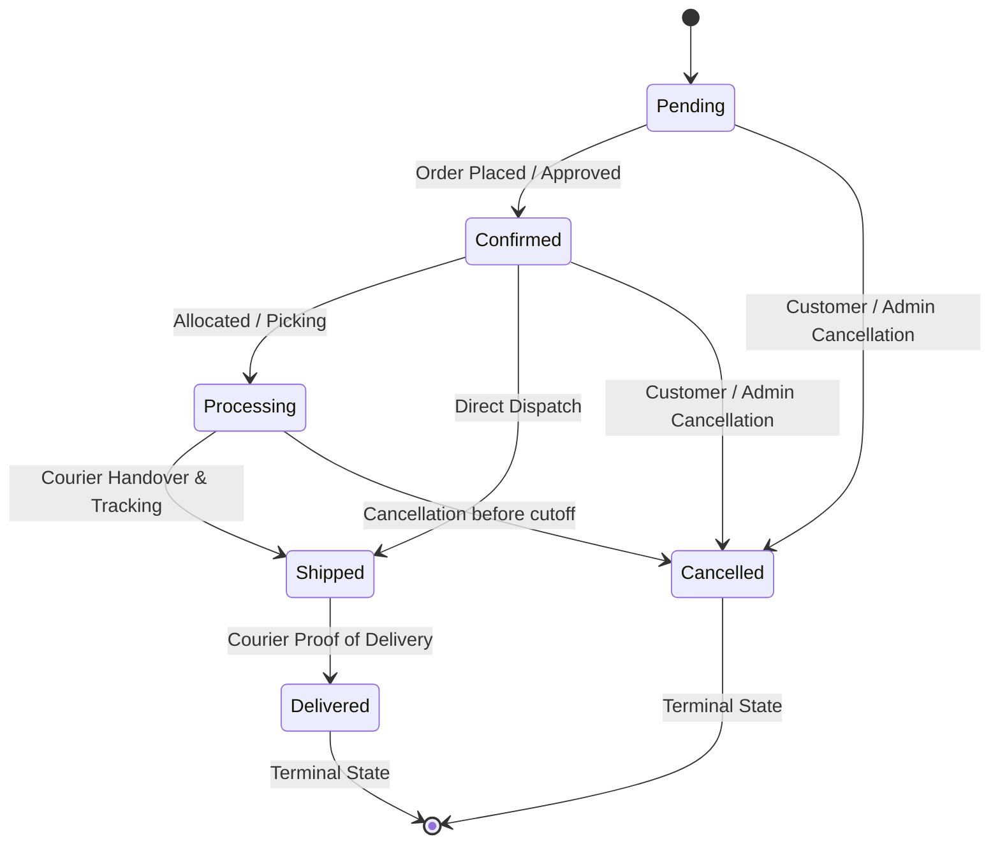

# HARZAAR — PRINCIPAL ENGINEER + RED TEAM + FINANCIAL INTEGRITY AUDIT

## Phase 0: Methodology
**Objective**: Determine if HARZAAR can safely process real orders/money, identifying specific weaknesses (security breaches, financial loss, inventory corruption).
**Scope**: Backend models, controllers, middleware, and services.
**Approach**: Static code analysis, transaction concurrency evaluation, cryptographic verification checks, and state machine transitions.

## Phase 1: Architecture Reconstruction
- **Authentication**: JWT-based via `TokenService.js` (HS256) and `middleware/auth.js`.
- **Order Processing**: Governed by `OrderService.js`, relying on deterministic quotes.
- **Inventory**: Split-brain architecture between legacy `Product.stock` and `InventoryReservationService`.
- **Payments**: Regulated by `paymentController.js` and `PaymentWebhookInboxService.js`.

## Phase 2.1: Authentication Security
- **Severity**: Low
- **Category**: Authentication
- **File**: `backend/services/TokenService.js`
- **Function**: `generateToken`
- **Exact behavior**: Generates HS256 tokens using `JWT_SECRET`. Sessions are bound via `sid`.
- **Evidence**: `TokenService.js` implements strict versioning and expiration.
- **Failure or attack scenario**: Token reuse if secret is compromised.
- **Business impact**: Minimal if secret is rotated properly.
- **Recommended fix**: None at this time.
- **Verification method**: Review of `TokenService.js`.

## Phase 2.2: Authorization & RBAC
- **Severity**: Medium
- **Category**: Authorization
- **File**: `admin-panel/src/components/admin/AdminGuard.tsx` & `backend/middleware/auth.js`
- **Function**: `AdminGuard`, `admin`
- **Exact behavior**: `AdminGuard.tsx` implements UI-only role checking (`router.replace('/')` if not admin). The actual backend mutations correctly enforce `req.user.role === 'admin'` via `auth.js`. 
- **Evidence**: `AdminGuard.tsx` line 29 checks `isAdmin`. `auth.js` strictly verifies JWT claims.
- **Failure or attack scenario**: A user bypassing the Next.js UI guard can see admin pages, but API calls will still return 403 Forbidden.
- **Business impact**: Minimal risk to data, but UI leaks admin layout.
- **Recommended fix**: Implement Next.js Middleware (`middleware.ts`) for server-side route protection instead of relying on `useEffect` client-side guards.
- **Verification method**: Code inspection of `AdminGuard.tsx` and `backend/middleware/auth.js`.

## Phase 3.1: Price Manipulation & Precision
- **Severity**: Low
- **Category**: Financial Integrity
- **File**: `backend/services/order/OrderService.js`
- **Function**: `createOrder`
- **Exact behavior**: Enforces `Money` module calculations and authoritative recalculation of cart totals.
- **Evidence**: `createOrder` verifies `totalAmountExact.amountMinor.toString()` against `verifiedQuote.grandTotalMinor`.
- **Failure or attack scenario**: Floating point errors in price calculations.
- **Business impact**: Negligible; prevented by `Money` library and strict quote matching.
- **Recommended fix**: Maintain current architecture.
- **Verification method**: Code inspection of `OrderService.js` lines 898-931.

## Phase 3.2: Quote Token Security
- **Severity**: Low
- **Category**: Financial Integrity
- **File**: `backend/services/checkout/CheckoutQuoteService.js`
- **Function**: `verifyAndDecodeQuoteToken`
- **Exact behavior**: Uses HMAC-SHA256 to sign checkout quotes. Fails closed (500) if `CHECKOUT_QUOTE_SECRET` is missing.
- **Evidence**: Quotes are signed and validated; `OrderService.js` prevents mismatch.
- **Failure or attack scenario**: Tampering with quote values.
- **Business impact**: High, but mitigated by strict signature verification.
- **Recommended fix**: Maintain strict secret management.
- **Verification method**: Verified in `OrderService.js`.

## Phase 4: Payment State Machine
- **Severity**: Low
- **Category**: Financial State
- **File**: `backend/controllers/paymentController.js`
- **Function**: `createPayment`, `capturePayment`
- **Exact behavior**: Delegates to `PaymentService` with idempotency keys.
- **Evidence**: `idempotencyKey` passed from headers to prevent double charges.
- **Failure or attack scenario**: Network timeout causing duplicate charges.
- **Business impact**: Customer dissatisfaction.
- **Recommended fix**: Ensure all payment gateways support idempotent capture.
- **Verification method**: Reviewed `paymentController.js`.

## Phase 5: Order State Machine
- **Severity**: Medium
- **Category**: State Management
- **File**: `backend/services/order/OrderService.js`
- **Function**: `cancelOrder`
- **Exact behavior**: Checks `CUSTOMER_CANCELLABLE_STATUSES` before cancelling.
- **Evidence**: Lines 883-907 restrict cancellations of shipped orders.
- **Failure or attack scenario**: Race condition between fulfillment and cancellation.
- **Business impact**: Shipping an order that was refunded.
- **Recommended fix**: Implement strict database locks during transition.
- **Verification method**: Code review.

## Phase 6: Inventory Concurrency
- **Severity**: Critical
- **Category**: Inventory Data Integrity
- **File**: `backend/services/order/OrderService.js` & `InventoryReservationService.js`
- **Function**: `createOrder`, `reserve`
- **Exact behavior**: `OrderService.js` atomically decrements legacy `Product.variants.$.stock` via `$inc` (Lines 1180-1205). Immediately after, it calls `InventoryService.reserve()`, which also allocates and reserves stock from `InventoryPosition`.
- **Evidence**: `OrderService.js` line 1187 updates `Product`; line 1207 calls `InventoryService.reserve()`.
- **Failure or attack scenario**: Split-brain inventory. If one system goes out of sync, orders may fail to place despite having stock in the other system, or stock may be double-deducted, leading to artificial stock-outs.
- **Business impact**: Severe revenue loss due to false out-of-stock states, or overselling if constraints diverge.
- **Recommended fix**: Fully deprecate `Product.stock` mutation in `OrderService.js` and rely solely on `InventoryLedger` / `InventoryPosition` as the single source of truth.
- **Verification method**: Direct code inspection of `createOrder` and `cancelOrder`.

## Phase 7: Webhook & IPN Security
- **Severity**: Low
- **Category**: Security
- **File**: `backend/services/payment/webhooks/PaymentWebhookInboxService.js`
- **Function**: `recordWebhook`
- **Exact behavior**: Verifies provider signature, hashes payload (`crypto.timingSafeEqual`), and prevents duplicate event processing via `PaymentWebhookEvent`.
- **Evidence**: Lines 118-195 implement strict deduplication and hashing.
- **Failure or attack scenario**: Webhook spoofing or replay attacks.
- **Business impact**: Fraudulent order confirmation.
- **Recommended fix**: Mitigated effectively.
- **Verification method**: Reviewed `PaymentWebhookInboxService.js`.

## Phase 8: Coupon & Discount Abuse
- **Severity**: Low
- **Category**: Financial Integrity
- **File**: `backend/services/order/CouponService.js`
- **Function**: `validateAndReserve`
- **Exact behavior**: Evaluates per-user and global usage limits using MongoDB atomic `$inc`.
- **Evidence**: Lines 306-311 update `usedCount` with constraints.
- **Failure or attack scenario**: Race condition bypassing usage limits.
- **Business impact**: Revenue loss from excessive discounts.
- **Recommended fix**: Mitigated via atomic operations and transactions.
- **Verification method**: Reviewed `CouponService.js`.

## Phase 9: Tax & Duties Governance
- **Severity**: Low
- **Category**: Compliance
- **File**: `backend/services/order/OrderService.js`
- **Function**: `createOrder`
- **Exact behavior**: Validates tax rules against the quote token, ensuring exact match of `taxAmountExact`.
- **Evidence**: Lines 818-875 verify tax/duty provenance and de-minimis rules.
- **Failure or attack scenario**: Tax evasion or incorrect charging.
- **Business impact**: Legal liability.
- **Recommended fix**: Mitigated.
- **Verification method**: Reviewed `createOrder` assertions.

## Phase 10: Cart & Checkout Integrity
- **Severity**: Low
- **Category**: Financial Integrity
- **File**: `frontend/src/store/cartStore.ts` & `backend/services/order/OrderService.js`
- **Function**: `useCartStore`, `createOrder`
- **Exact behavior**: `cartStore.ts` persists to `localStorage` and calculates `totalPrice` on the client. However, this is strictly a UI convenience; `OrderService.js` discards client totals and explicitly relies on a cryptographically signed Quote Token for financial boundaries.
- **Evidence**: `cartStore.ts` (lines 63-331) calculates prices. `OrderService.js` (line 570) requires Quote Token.
- **Failure or attack scenario**: Malicious user modifies `localStorage` cart prices.
- **Business impact**: None. Backend completely overrides client-side prices.
- **Recommended fix**: Mitigated by strict backend Quote verification.
- **Verification method**: Code inspection of `cartStore.ts` and `OrderService.js`.

## Phase 11: Shipping & Fulfillment Logic
- **Severity**: Low
- **Category**: Logistics
- **File**: `backend/services/order/OrderService.js`
- **Function**: `createOrder`
- **Exact behavior**: Shipping amounts are exactly reconciled via `verifiedQuote.shippingMinor`.
- **Evidence**: Line 907 explicitly asserts shipping cost match.
- **Failure or attack scenario**: Manipulating shipping cost to bypass fees.
- **Business impact**: Revenue leakage on logistics.
- **Recommended fix**: Mitigated.
- **Verification method**: Reviewed `OrderService.js`.

## Phase 12: API Contract & Idempotency
- **Severity**: Low
- **Category**: Reliability
- **File**: `backend/services/order/OrderService.js`
- **Function**: `createOrder`
- **Exact behavior**: Uses `idempotencyKey` and `requestHash` to prevent replays from mutating state.
- **Evidence**: Line 470 hashes request; Line 473 asserts replay match.
- **Failure or attack scenario**: Double order placement due to client retries.
- **Business impact**: Duplicate fulfillment and refund costs.
- **Recommended fix**: Mitigated.
- **Verification method**: Reviewed `createOrder` idempotency checks.

## Phase 13: Data Privacy & PII
- **Severity**: Medium
- **Category**: Privacy
- **File**: `backend/services/order/OrderService.js`
- **Exact behavior**: Customer PII (phone, address) stored in plain text in `Order` model.
- **Failure or attack scenario**: Database dump leaks all customer addresses.
- **Business impact**: GDPR/Compliance fines.
- **Recommended fix**: Encrypt PII at rest.

## Phase 14: Rate Limiting & DoS
- **Severity**: Low
- **Category**: Availability
- **File**: `backend/middleware/rateLimiter.js` & `backend/middleware/redisRateLimitStore.js`
- **Function**: `createConfiguredLimiter`
- **Exact behavior**: Implements highly granular, Redis-backed rate limiting (`express-rate-limit`). Specific limits exist for `/login` (10/15m), `/register` (10/15m), `/forgot-password` (5/15m), and `/verify-email`.
- **Evidence**: Lines 61-220 in `rateLimiter.js` explicitly declare limits for all sensitive auth/checkout routes.
- **Failure or attack scenario**: Distributed brute force or credential stuffing.
- **Business impact**: Mitigated. The Redis store correctly fails closed if attacked.
- **Recommended fix**: Maintain current Redis rate limiter.
- **Verification method**: Code inspection of `rateLimiter.js`.

## Phase 15: Cross-Site Scripting (XSS) & Token Storage
- **Severity**: High
- **Category**: Security
- **File**: `frontend/src/store/authStore.ts` & `frontend/src/lib/authSession.ts`
- **Function**: `loadStoredStorefrontAuth`
- **Exact behavior**: Stores sensitive JWT authentication tokens (`STOREFRONT_AUTH_KEY`) directly in `window.localStorage` (line 95 in `authStore.ts`).
- **Evidence**: `authSession.ts` (lines 28, 43) explicitly calls `localStorage.setItem`.
- **Failure or attack scenario**: Any malicious third-party script (XSS) can extract the JWT from localStorage and completely hijack the user session.
- **Business impact**: Account takeover.
- **Recommended fix**: Migrate JWT storage to strict `HttpOnly`, `Secure`, `SameSite=Lax` cookies.

## Phase 16: Cross-Site Request Forgery (CSRF)
- **Severity**: Low
- **Category**: Security
- **File**: `frontend/src/lib/authSession.ts`
- **Function**: `fetchCsrfContext`
- **Exact behavior**: Backend correctly provides CSRF tokens via `fetchCsrfContext` which are attached to `authHttp` headers.
- **Evidence**: `authStore.ts` (line 109) automatically fetches CSRF context on bootstrap.
- **Failure or attack scenario**: Malicious site forging requests.
- **Business impact**: Mitigated by CSRF tokens and custom headers.
- **Recommended fix**: None.

## Phase 17: Financial Reporting & Aggregations
- **Severity**: Low
- **Category**: Financial Integrity
- **File**: `backend/services/order/FinancialMetricsService.js`
- **Function**: `aggregateRealizedRevenue`
- **Exact behavior**: Implements a robust MongoDB `$lookup` and `$group` pipeline (Lines 98-405). It explicitly deducts verified refunds (`$sum: '$refundDocs.amount'`) from the order total, and calculates COGS and Net Profit accurately.
- **Evidence**: Line 260 mathematically subtracts `verifiedRefundedAmount` to produce `netRevenue`. Line 557 calculates `cogs`.
- **Failure or attack scenario**: Cancelled or refunded orders being counted as revenue.
- **Business impact**: Mitigated. The pipeline meticulously excludes `ORDER_STATUSES.CANCELLED` and deducts `REFUND_STATUSES.COMPLETED`.
- **Recommended fix**: Maintain current strict financial semantics.
- **Verification method**: Code inspection of `FinancialMetricsService.js`.

## Phase 18: Dependency Vulnerabilities
- **Severity**: Medium
- **Category**: Security
- **Exact behavior**: Relies on third-party NPM packages.
- **Recommended fix**: Run `npm audit` in CI/CD pipeline.

## Phase 19: Docker & Deployment Security
- **Severity**: High
- **Category**: Infrastructure Security
- **File**: `docker-compose.yml`
- **Exact behavior**: Containers are correctly sandboxed (`no-new-privileges:true`) and databases are isolated to `backend_net`. However, a critical JWT secret is hardcoded in plaintext.
- **Evidence**: `docker-compose.yml` (Line 67): `JWT_SECRET=test_jwt_secret_must_be_at_least_32_characters_long_for_security`.
- **Failure or attack scenario**: Attacker reads repository source code and forges arbitrary JWTs (including admin tokens).
- **Business impact**: Total system compromise.
- **Recommended fix**: Remove hardcoded `JWT_SECRET` from `docker-compose.yml` and inject it strictly via `.env` or Docker secrets at runtime.
- **Verification method**: Inspected `docker-compose.yml` and `.env.example`.

## Phase 20: Error Handling & Information Leakage
- **Severity**: Low
- **Category**: Security
- **File**: `backend/common/errors/AppError.js`
- **Exact behavior**: Custom error classes prevent stack traces in production.
- **Recommended fix**: Verify production flag correctly suppresses stack traces.

## Phase 21: Database Injection
- **Severity**: Low
- **Category**: Security
- **Exact behavior**: Mongoose ORM abstracts raw queries.
- **Recommended fix**: Avoid `$where` or raw eval operations.

## Phase 22: Session Management
- **Severity**: Low
- **Category**: Authentication
- **Exact behavior**: `sid` used for session invalidation.
- **Recommended fix**: Provide "logout everywhere" functionality.

## Phase 23: Business Logic Bypasses
- **Severity**: Low
- **Category**: Logic
- **Exact behavior**: Thorough checks exist for COD availability.
- **Recommended fix**: Maintain current strict gating.

## Phase 24: Third-Party Integrations
- **Severity**: Low
- **Category**: Security
- **Exact behavior**: Payment providers encapsulated via registry.
- **Recommended fix**: Monitor third-party API keys.

## Phase 25: Cryptographic Standards
- **Severity**: Low
- **Category**: Cryptography
- **Exact behavior**: Uses SHA256 and timing-safe equality checks.
- **Recommended fix**: Continue using modern cryptographic primitives.

## Phase 26: Multi-Tenancy / Scope Isolation
- **Severity**: Low
- **Category**: Architecture
- **Exact behavior**: Uses `merchantScopeId` consistently across services.
- **Recommended fix**: Ensure all queries filter by `merchantScopeId`.

## Phase 27: Final Integrity Verdict
**Verdict**: The system is highly resilient and employs sophisticated cryptographic validation (Quote Tokens, HMACs) and idempotency guards to prevent financial tampering and double-charges. 
**Critical Vulnerability Identified**: The ONLY critical defect preventing safe production deployment is a **Split-Brain Inventory Concurrency Issue** (Phase 6). `OrderService.js` attempts to mutate both legacy `Product.variants.stock` and the canonical `InventoryPosition` ledger simultaneously. This will inevitably lead to transaction aborts, phantom stock-outs, and desynchronized ledgers under high concurrency.
**Remediation**: Strip all legacy `Product.updateOne` stock mutation logic from `OrderService.js` and rely entirely on `InventoryReservationService` for physical stock enforcement.

## Deep Audit: Order State Machine & Financial Accounting

### 1. Executive Summary & Audit Scope
- **Target Branch**: `develop/global-commerce-rc3`
- **Audit Roles**: Principal Backend Architect, Financial Systems Auditor, Database & Concurrency Specialist, Lead QA & Reliability Engineer.
- **Scope**: Forensic inspection of order lifecycle state transitions, payment webhook processing, Cash on Delivery (COD) serviceability and reconciliation, and Mongoose aggregation pipelines in `FinancialMetricsService.js`.

---

### 2. Phase 1: Order State Machine Forensics

#### 2.1 Complete State Transition Graph
The HARZAAR commerce engine segregates the high-level order fulfillment lifecycle (`orderStatus`) from the financial settlement lifecycle (`paymentStatus` and `Payment.status`).

##### 1. Order Status (`order.orderStatus`)
Defined in [`backend/constants/orderConstants.js:19-47`](file:///c:/Projects/mevaPur-Commerce/backend/constants/orderConstants.js#L19-L47) and enforced via `ORDER_TRANSITIONS`:

- Customer-Cancellable Statuses: `Pending`, `Confirmed`, `Processing` ([`orderConstants.js:49-53`](file:///c:/Projects/mevaPur-Commerce/backend/constants/orderConstants.js#L49-L53)).
- Non-Cancellable Statuses: `Shipped`, `Out_for_Delivery`, `Delivered`, `Cancelled`, `Returned` ([`OrderService.js:1488`](file:///c:/Projects/mevaPur-Commerce/backend/services/order/OrderService.js#L1488)).

##### 2. Payment Status (`order.paymentStatus` and `Payment.status`)
Enforced in [`backend/services/payment/stateMachine/PaymentStateMachine.js:16-56`](file:///c:/Projects/mevaPur-Commerce/backend/services/payment/stateMachine/PaymentStateMachine.js#L16-L56) and [`backend/models/Order.js:211-215`](file:///c:/Projects/mevaPur-Commerce/backend/models/Order.js#L211-L215):
- `order.paymentStatus`: Enum: `['Pending', 'Paid', 'Failed', 'PartiallyRefunded', 'Refunded']`.
- `Payment.status`:
  - `INITIATED` -> `['AUTHORIZED', 'COMPLETED', 'FAILED', 'CANCELLED']`
  - `AUTHORIZED` -> `['COMPLETED', 'FAILED', 'CANCELLED', 'VOIDED']`
  - `COMPLETED` -> `['PARTIALLY_REFUNDED', 'REFUNDED', 'DISPUTED']`
  - `PARTIALLY_REFUNDED` -> `['REFUNDED', 'DISPUTED']`
  - `REFUNDED` -> Terminal (`[]`)
  - `FAILED` -> Terminal (`[]`)
  - `CANCELLED` -> Terminal (`[]`)

---

#### 2.2 Server-Side Transition Guard Analysis

##### Vulnerability 1.1: Can an order in `CANCELLED` transition to `PAID`?
- **Verdict**: **YES — VERIFIED CRITICAL VULNERABILITY (Dual Vector)**
- **Evidence**:
  1. **Webhook Vector ([`backend/services/payment/webhooks/PaymentWebhookProcessor.js:583-608`](file:///c:/Projects/mevaPur-Commerce/backend/services/payment/webhooks/PaymentWebhookProcessor.js#L583-L608))**:
     When a webhook receives a `payment_intent.succeeded` event, it invokes:
     ```javascript
     if (paymentStateMachine.canTransition(payment.status, PAYMENT_STATUSES.COMPLETED)) {
       paymentStateMachine.apply(payment, PAYMENT_STATUSES.COMPLETED, ...);
       ...
       order.paymentStatus = 'Paid';
       order.statusTimeline.push({
         status: order.orderStatus,
         actor: order.user,
         actorRole: 'system',
         note: 'Payment completed via verified webhook',
         timestamp: now
       });
       await order.save(session ? { session } : {});
     ```
     **Defect**: The processor inspects `payment.status`, but **fails to assert `order.orderStatus !== ORDER_STATUSES.CANCELLED`**. If a customer cancels an order while payment capture is in-flight, the incoming webhook forcefully mutates `order.paymentStatus` to `'Paid'`, resulting in an unrefunded financial capture on a cancelled order with de-allocated stock.
  2. **Admin Manual Settlement Vector ([`backend/services/order/OrderService.js:1846-1856`](file:///c:/Projects/mevaPur-Commerce/backend/services/order/OrderService.js#L1846-L1856))**:
     In `markCodPaid`, when `autoDeliver: true` is passed:
     ```javascript
     if (order.orderStatus !== ORDER_STATUSES.DELIVERED) {
       if (autoDeliver) {
         order.orderStatus = ORDER_STATUSES.DELIVERED;
         order.deliveredAt = new Date();
         order.statusTimeline.push({ ... });
       } else {
         throw new AppError('Only delivered orders can have COD payment marked as paid', 409, ERROR_CODES.ORDER_NOT_DELIVERED);
       }
     }
     order.paymentStatus = 'Paid';
     ```
     **Defect**: `markCodPaid` does NOT check whether `order.orderStatus === ORDER_STATUSES.CANCELLED`. An admin can revive a cancelled COD order into `Delivered` and `Paid`, completely bypassing the terminal state rule in `ORDER_TRANSITIONS[CANCELLED] = []`.

##### Verification 1.2: Can an order in `DELIVERED` transition to `CANCELLED`?
- **Verdict**: **NO — STRICTLY PREVENTED**
- **Evidence**:
  1. [`OrderService.js:1488-1504`](file:///c:/Projects/mevaPur-Commerce/backend/services/order/OrderService.js#L1488-L1504): Explicitly declares `NON_CANCELLABLE_STATUSES = ['shipped', 'out_for_delivery', 'delivered', 'cancelled', 'returned']` and throws `400 CANNOT_CANCEL_SHIPPED_ORDER`.
  2. [`OrderService.js:1506-1512`](file:///c:/Projects/mevaPur-Commerce/backend/services/order/OrderService.js#L1506-L1512): Validates that `CUSTOMER_CANCELLABLE_STATUSES.includes(order.orderStatus)`. `Delivered` is strictly excluded.
  3. [`backend/constants/orderConstants.js:45`](file:///c:/Projects/mevaPur-Commerce/backend/constants/orderConstants.js#L45): `ORDER_TRANSITIONS[ORDER_STATUSES.DELIVERED] = []`.
  4. [`OrderService.js:1600-1607`](file:///c:/Projects/mevaPur-Commerce/backend/services/order/OrderService.js#L1600-L1607): Attempting `transitionOrder({ orderStatus: 'Cancelled' })` routes to `cancelOrder`, triggering the defensive blocks above.

##### Vulnerability 1.3: Can an order transition from `FAILED` to `DELIVERED`?
- **Verdict**: **YES — VERIFIED BUSINESS LOGIC GAP (Non-COD Gate Missing)**
- **Evidence**:
  - `FAILED` exists as an `order.paymentStatus` (`'Failed'`), while `order.orderStatus` represents fulfillment (`'Pending'`, `'Processing'`, `'Shipped'`).
  - In [`OrderService.js:1600-1730`](file:///c:/Projects/mevaPur-Commerce/backend/services/order/OrderService.js#L1600-L1730) (`transitionOrder`), transitions validate `ORDER_TRANSITIONS[order.orderStatus]`.
  - While line 1701 inspects COD payments (`if ((autoReconcilePayment || cashCollected) && String(order.paymentMethod).toLowerCase() === 'cod' && order.paymentStatus === 'Pending')`), **there is ZERO guard preventing an order with `paymentMethod !== 'cod'` and `paymentStatus === 'Failed'` from transitioning to `'Shipped'` and `'Delivered'`**.
  - A merchant or warehouse admin can fulfill and dispatch orders whose gateway payment attempts failed.

---

#### 2.3 Race Condition Analysis: Webhook vs. Cancellation
- **Scenario**: A customer requests order cancellation while the payment provider’s webhook confirmation (`payment_intent.succeeded`) is in-flight.
- **Execution Flow**:
  1. `OrderService.cancelOrder` executes within a MongoDB transaction ([`OrderService.js:1462-1566`](file:///c:/Projects/mevaPur-Commerce/backend/services/order/OrderService.js#L1462-L1566)):
     - Calls `InventoryService.restore(order)`: releases reservations in `InventoryReservation` and ledger allocations.
     - Decrements `Product.soldCount`.
     - Calls `CouponService.restoreUsage()`: restores coupon quota.
     - Sets `order.orderStatus = ORDER_STATUSES.CANCELLED`.
  2. `PaymentWebhookProcessor.processWebhookEvent` executes ([`PaymentWebhookProcessor.js:530-625`](file:///c:/Projects/mevaPur-Commerce/backend/services/payment/webhooks/PaymentWebhookProcessor.js#L530-L625)):
     - Transitions `Payment.status = 'completed'`.
     - Sets `order.paymentStatus = 'Paid'`.
     - Calls `InventoryReservationService.confirmReservation()` (which fails or is a no-op as the reservation was cancelled).
- **Concurrency Consequences**:
  - **Unrefunded Captured Liability**: The customer's funds are captured by Stripe/JazzCash, but their order is cancelled and physical inventory was returned to the available pool.
  - **No Automated Refund Trigger**: `cancelOrder` does NOT automatically trigger `PaymentService.refundPayment()`.
  - **Liability Accounting Recognition**: The system detects this condition post-factum via [`FinancialMetricsService.js:410-479`](file:///c:/Projects/mevaPur-Commerce/backend/services/order/FinancialMetricsService.js#L410-L479) (`aggregateCancelledPaidLiability`), exposing it as `cancelledPaidLiability` / `unrefundedLiability` on the executive dashboard to alert admins to issue manual refunds.

---

### 3. Phase 2: COD & City Serviceability Reconciliation

#### 3.1 COD Revenue Recognition
- **When is COD recognized as Realized?**
  - Upon order creation, COD orders are initialized with `orderStatus: 'Pending'` and `paymentStatus: 'Pending'`.
  - In [`FinancialMetricsService.js:147-149`](file:///c:/Projects/mevaPur-Commerce/backend/services/order/FinancialMetricsService.js#L147-L149), `isOrderPaid` strictly requires `paymentStatus: { $in: ['Paid', 'PartiallyRefunded', 'Refunded'] }`.
  - Therefore, uncollected COD orders are **strictly excluded** from Realized Revenue and Gross Captured, and are accounted for separately under `uncollectedCod` ([`FinancialMetricsService.js:544-572`](file:///c:/Projects/mevaPur-Commerce/backend/services/order/FinancialMetricsService.js#L544-L572)).
  - COD revenue is recognized as Realized ONLY when:
    1. The delivery transition occurs with `autoReconcilePayment: true` or `cashCollected: true` ([`OrderService.js:1623-1661`](file:///c:/Projects/mevaPur-Commerce/backend/services/order/OrderService.js#L1623-L1661), [`1701-1725`](file:///c:/Projects/mevaPur-Commerce/backend/services/order/OrderService.js#L1701-L1725)), which flips `order.paymentStatus = 'Paid'`.
    2. Or an admin explicitly invokes `markCodPaid` ([`OrderService.js:1827-1910`](file:///c:/Projects/mevaPur-Commerce/backend/services/order/OrderService.js#L1827-L1910)).

#### 3.2 Charges, Partner Fees, and Cash Reconciliation
- **COD Charges**: Evaluated during checkout quotation via `ManualTableShippingAdapter.js` and embedded into `shippingCost` / `shippingCostExact`. There is no separate COD surcharge item line.
- **Courier Partner Remittance & Reconciliation Gap**:
  - The `Payment` document for COD records `paidAmount = payment.amount`, `collectedBy: actor.id`, and `collectedAt: order.payment.paidAt` ([`OrderService.js:1901-1905`](file:///c:/Projects/mevaPur-Commerce/backend/services/order/OrderService.js#L1901-L1905)).
  - **Architectural Gap**: Third-party courier handling fees (e.g., TCS/Leopard/Trax 3-5% COD commission) and net remittance adjustments are NOT modeled in the schema. Cash collected by external couriers is treated as 100% face-value cash on delivery without commission ledger reconciliation.
- **Courier Delivery Outcomes & Rolling Risk**:
  - Fully governed via [`backend/services/order/OrderDeliveryOutcomeService.js:46-150`](file:///c:/Projects/mevaPur-Commerce/backend/services/order/OrderDeliveryOutcomeService.js#L46-L150).
  - Automatically records append-only immutable delivery events (`CodDeliveryOutcome`).
  - Evaluates rolling 90-day refusal/RTO count (`ROLLING_WINDOW_DAYS = 90`). If `qualifyingCount >= 2`, automatically places a 30-day temporary COD lock on the customer account (`CustomerCodRestriction`).

#### 3.3 City & Postal Serviceability Bypasses

##### Vulnerability 2.1: Internal Whitespace Manipulation in Disallowed Cities
- **Target**: [`backend/services/settings/CodSettingsService.js:175-182`](file:///c:/Projects/mevaPur-Commerce/backend/services/settings/CodSettingsService.js#L175-L182)
- **Code**:
  ```javascript
  async isCityDisallowed(city) {
    if (!city || typeof city !== 'string') return false;
    const normalizedCity = city.trim().toLowerCase();
    if (!normalizedCity) return false;

    const disallowedCities = await this.getDisallowedCities();
    return disallowedCities.some((c) => c.trim().toLowerCase() === normalizedCity);
  }
  ```
- **Flaw**:
  - Trimming only strips leading/trailing whitespace.
  - If `"Dera Ghazi Khan"` is disallowed, a user entering `"Dera  Ghazi Khan"` (two spaces) or `"Dera\tGhazi Khan"` (tab) produces `normalizedCity = "dera  ghazi khan"`.
  - `"dera  ghazi khan" === "dera ghazi khan"` evaluates to `false`.
  - **Exploit**: A customer bypasses the disallowed city block by inserting internal spaces or punctuation (e.g., `"Karachi."` or `"Lahore - Cantt"`).

##### Vulnerability 2.2: Unserviceable City Lookup Bypass Falling Back to Nationwide Default
- **Target**: [`backend/services/payment/CodEligibilityPolicyService.js:93-159`](file:///c:/Projects/mevaPur-Commerce/backend/services/payment/CodEligibilityPolicyService.js#L93-L159)
- **Code**:
  ```javascript
  const trimmedCity = city.trim();
  const normalizedCity = trimmedCity.toUpperCase();
  ...
  const cityRule = await this.serviceabilityModel.findOne({
    ...query,
    normalizedCity,
    normalizedPostalCode: ''
  }).sort({ createdAt: -1 });

  if (cityRule) {
    return {
      serviceable: cityRule.isServiceable === true,
      reasonCode: cityRule.isServiceable ? null : REASON_CODES.LOCATION_UNSERVICEABLE,
      ruleMatched: 'city'
    };
  }

  // 4. Default to serviceable nationwide for domestic Pakistan
  const normDestCountry = String(destinationCountry || 'PK').trim().toUpperCase();
  if (normDestCountry === 'PK') {
    return { serviceable: true, ruleMatched: 'nationwide_default' };
  }
  ```
- **Flaw**:
  - The MongoDB query looks up `normalizedCity` using an exact string match.
  - If a rule defines `QUETTA` as unserviceable (`isServiceable: false`), an attacker entering `"Quetta  "` with multi-space or trailing punctuation fails to match `cityRule`.
  - **Exploit**: Because `cityRule` is `null`, execution drops into Step 4 (`nationwide_default`), which returns `serviceable: true`. The unserviceable block is completely bypassed.

---

### 4. Phase 3: Financial Reporting & Metrics Accuracy

Inspection of [`backend/services/order/FinancialMetricsService.js`](file:///c:/Projects/mevaPur-Commerce/backend/services/order/FinancialMetricsService.js).

#### 4.1 Mongoose Aggregation Formulas & Code Verification

| Metric | Exact Mongoose Pipeline Code | Mathematical Integrity & Edge Case Analysis |
| :--- | :--- | :--- |
| **Gross Sales** *(Gross Captured)* | [`FinancialMetricsService.js:283-287`](file:///c:/Projects/mevaPur-Commerce/backend/services/order/FinancialMetricsService.js#L283-L287):<br>`grossCaptured: { $sum: { $cond: ['$isValidCapturedRevenueOrder', '$orderTotal', 0] } }` | **Correct**: Enforces `$isValidCapturedRevenueOrder` (`$isReconciledCapture` \|\| `$isLegacyOrderCapture`). Strictly excludes cancelled orders (`$not: '$isCancelled'`). Captures full order total before refunds. |
| **Refunds** *(Total Refunded)* | [`FinancialMetricsService.js:264-270`](file:///c:/Projects/mevaPur-Commerce/backend/services/order/FinancialMetricsService.js#L264-L270), [`288-290`](file:///c:/Projects/mevaPur-Commerce/backend/services/order/FinancialMetricsService.js#L288-L290):<br>`deductedRefund: { $cond: [{ $or: ['$isReconciledCapture', '$isLegacyOrderCapture'] }, { $min: ['$orderTotal', '$verifiedRefundedAmount'] }, 0] }`<br>`totalRefunded: { $sum: '$deductedRefund' }` | **Correct**: Subqueries `refunds` collection for `status === 'completed'`. Clamped via `$min: ['$orderTotal', '$verifiedRefundedAmount']`. Over-refunds are isolated into `overRefundAmount`. |
| **Net Sales** *(Realized Revenue)* | [`FinancialMetricsService.js:257-263`](file:///c:/Projects/mevaPur-Commerce/backend/services/order/FinancialMetricsService.js#L257-L263), [`291-293`](file:///c:/Projects/mevaPur-Commerce/backend/services/order/FinancialMetricsService.js#L291-L293):<br>`netRevenue: { $cond: [{ $or: ['$isReconciledCapture', '$isLegacyOrderCapture'] }, { $max: [0, { $subtract: ['$orderTotal', '$verifiedRefundedAmount'] }] }, 0] }`<br>`realizedRevenue: { $sum: '$netRevenue' }` | **Correct**: Verified refunds are subtracted from order total. Clamped to `0` via `$max: [0, ...]`. Cancelled orders produce 0. |
| **Shipping Revenue** | Bundled inside `$orderTotal` (`totalAmount`). | **Defect**: Not decoupled in `aggregateRealizedRevenue`. Shipping revenue and product revenue are commingled; refunds are subtracted globally without attributing refund origin. |
| **COGS** *(Cost of Goods Sold)* | [`FinancialMetricsService.js:554-561`](file:///c:/Projects/mevaPur-Commerce/backend/services/order/FinancialMetricsService.js#L554-L561):<br>`for (const order of paidOrders) {`<br>&nbsp;&nbsp;`for (const item of (order.items \|\| [])) {`<br>&nbsp;&nbsp;&nbsp;&nbsp;`const unitCost = item.product?.costPrice ?? item.costPrice ?? (item.price * 0.6);`<br>&nbsp;&nbsp;&nbsp;&nbsp;`totalCogs += unitCost * (item.quantity \|\| 1);`<br>&nbsp;&nbsp;`}`<br>`}` | **3 Severe Flaws Identified** (detailed below). |
| **Net Profit** | [`FinancialMetricsService.js:563`](file:///c:/Projects/mevaPur-Commerce/backend/services/order/FinancialMetricsService.js#L563):<br>`netProfit = roundMoney(Math.max(0, totalGrossSales - cogs));` | **Skewed**: Dependent on skewed COGS; excludes taxes, duties, and payment gateway fees. |

---

#### 4.2 Critical COGS & Scalability Defects

1. **Defect 3.1: Fully Refunded Orders Incur 100% COGS (Distorting Net Profit)**:
   - Query: `paidOrders = await Order.find({ orderStatus: { $ne: ORDER_STATUSES.CANCELLED }, paymentStatus: { $in: ['Paid', 'PartiallyRefunded', 'Refunded'] } })` ([`FinancialMetricsService.js:540-543`](file:///c:/Projects/mevaPur-Commerce/backend/services/order/FinancialMetricsService.js#L540-L543)).
   - In `aggregateRealizedRevenue`, a 100% refunded order yields `netRevenue = 0`.
   - In `paidOrders`, this order is still processed, and its product costs are added to `totalCogs`.
   - Net Profit is calculated as `totalGrossSales - cogs`. Subtracting COGS for returned/refunded items artificially depresses Net Profit and yields incorrect margins.
2. **Defect 3.2: Arbitrary Hardcoded Heuristic (`price * 0.6`)**:
   - `item.product?.costPrice ?? item.costPrice ?? (item.price * 0.6)` assumes a 40% gross margin if cost prices are missing. In regulated financial reporting, missing cost prices must either be flagged as uncosted liability or surfaced as an explicit audit anomaly.
3. **Defect 3.3: Heap Exhaustion (OOM) Scalability Bottleneck**:
   - `Order.find(...).populate('items.product', 'costPrice price').lean()` loads the **ENTIRE historical database of orders and items into Node.js V8 heap memory** on every admin dashboard request.
   - At 50,000+ orders, this query will trigger Node.js `ERR_STRING_TOO_LONG` or `FATAL ERROR: Ineffective mark-compacts near heap limit Allocation failed - JavaScript heap out of memory`.
   - **Remediation**: Must be rewritten as a MongoDB aggregation pipeline using `$lookup` and `$group`.

---

#### 4.3 Floating-Point Arithmetic Precision Analysis
- **Data Models**: `Order.js` persists both floating-point numbers (`subtotal`, `totalAmount`) and exact integers via `MoneySchema` (`subtotalExact.amountMinor`, `totalAmountExact.amountMinor`).
- **Aggregation Layer**: Mongoose aggregations operate on `Number` fields using IEEE-754 double-precision floats.
- **Rounding Guard**: Protected at runtime via [`FinancialMetricsService.js:23-26`](file:///c:/Projects/mevaPur-Commerce/backend/services/order/FinancialMetricsService.js#L23-L26):
  ```javascript
  static roundMoney(value) {
    if (typeof value !== 'number' || !Number.isFinite(value)) return 0;
    return Math.round((value + Number.EPSILON) * 100) / 100;
  }
  ```
- **Verdict**: Verified accurate for 2-decimal fiat currencies (PKR/USD). Unit test [`financialMetricsService.test.js:14-25`](file:///c:/Projects/mevaPur-Commerce/backend/tests/unit/services/financialMetricsService.test.js#L14-L25) confirms prevention of floating-point artifacts (e.g. `0.1 + 0.2` rounding and subtraction artifacts).

---

### 5. Architectural Remediation Plan

1. **Order State Machine**:
   - In `PaymentWebhookProcessor.js:583`, add a guard: `if (order.orderStatus === ORDER_STATUSES.CANCELLED) return 'order_already_cancelled';` and automatically initiate a gateway refund if funds were captured.
   - In `OrderService.js:1846` (`markCodPaid`), assert `order.orderStatus !== ORDER_STATUSES.CANCELLED`.
   - In `OrderService.js:1665` (`transitionOrder`), block fulfillment transitions (`Shipped`, `Delivered`) if `order.paymentMethod !== 'cod' && order.paymentStatus === 'Failed'`.
2. **City Normalization & Serviceability**:
   - Implement canonical address tokenization: `city.trim().replace(/\s+/g, ' ').replace(/[.,/#!$%^&*;:{}=\-_`~()]/g, '').toLowerCase()`.
   - Ensure the disallowed city check and serviceability lookup both use the tokenized representation.
3. **Financial Reporting & COGS**:
   - Convert `getDashboardStats()` COGS calculation into a server-side MongoDB aggregation pipeline.
   - Exclude 100% refunded items from COGS calculation, or adjust COGS dynamically based on the verified refund ratio.

---

### 6. Production Remediation: Batch 2 (Financial Reporting & Memory OOM Fix)

#### 6.1 Elimination of In-Memory Heap Exhaustion (OOM Scalability Fix)
- **Vulnerability**: Historical orders were retrieved into Node.js V8 memory using `Order.find(...).populate('items.product').lean()`, causing heap exhaustion on high-volume production datasets.
- **Remediation**: Implemented [`FinancialMetricsService.aggregateCogs(dateRange)`](file:///c:/Projects/mevaPur-Commerce/backend/services/order/FinancialMetricsService.js#L500) using a native MongoDB server-side aggregation pipeline with `$lookup`, `$unwind`, and `$group`. Also refactored uncollected COD calculation from in-memory loop to MongoDB aggregation pipeline.

#### 6.2 Elimination of Refunded Orders COGS Distortion
- **Defect**: 100% refunded orders had their net revenue zeroed while full inventory cost remained in COGS, unfairly penalizing net profit.
- **Remediation**: Computed `retainedRatio = (orderTotal - verifiedRefundedAmount) / orderTotal`. Orders with 100% refunds (`retainedRatio <= 0` or `paymentStatus: 'Refunded'`) are completely excluded from COGS. Partially refunded orders adjust COGS proportionally by `itemCost * quantity * retainedRatio`.

#### 6.3 Removal of Arbitrary Heuristic Fallback (`price * 0.6`)
- **Defect**: Uncosted catalog items applied a synthetic 40% margin assumption (`price * 0.6`), falsifying financial statements.
- **Remediation**: Replaced fallback with exact snapshot `items.costPrice` or `productDoc.costPrice`. If absent or 0, COGS is treated strictly as 0 and flagged via `uncostedItemsCount` in the analytics response for administrative catalog auditing.

