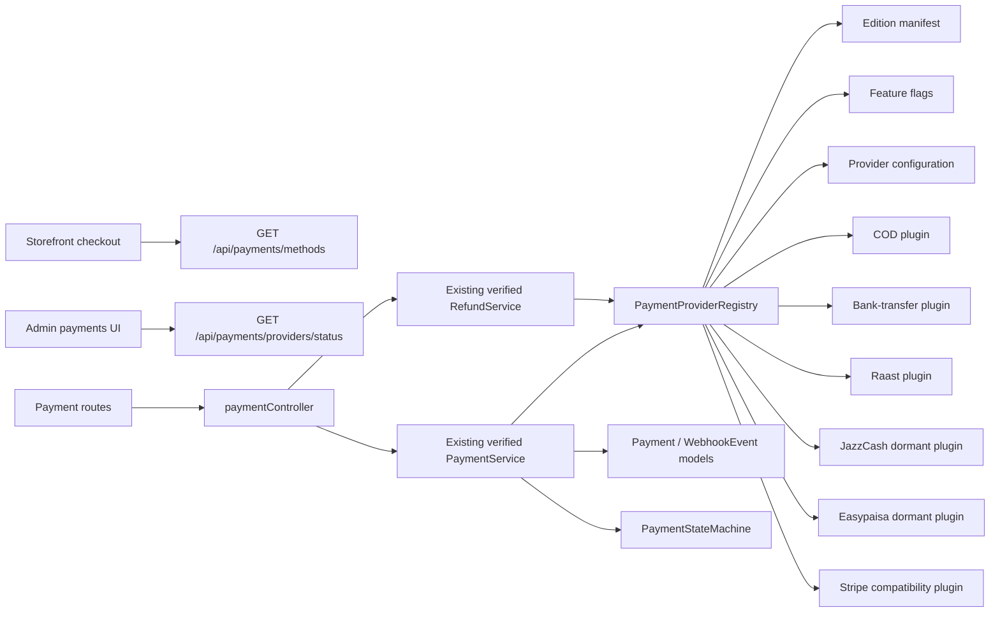

# P2.2 Multi-Provider Payment Report

## 1. Recovery Checkpoint

The post-P2, pre-provider-architecture recovery gate passed before any P2.2
source change.

- External backup:
  `C:\MevaPur-Backups\mevaPur-post-p2-pre-provider-architecture-20260727-164955`
- Backup result: Robocopy exit code `1` (successful copy), 10,420 files,
  364.30 MB, 0 copy failures.
- Stable first-party SHA-256 comparison: 460/460 matched, 0 missing,
  0 extra, 0 mismatched.
- Pre-change status:
  `docs/P2_2_PRE_PROVIDER_GIT_STATUS.txt`
- Binary-capable pre-change patch:
  `docs/P2_2_PRE_PROVIDER_WORKING_TREE.patch`
- Patch SHA-256:
  `E894BD1FA873CB7880BD53B94AD2F45C797F1FA0F3AAAA91917EAE3660D50E55`
- Verified MongoDB dump retained:
  `C:\MevaPur-Backups\mongodb-pre-p0-20260727-115109`
- Dump contents checked: 14 BSON and 14 metadata files.
- No Atlas read, write, restore, drop, or index migration was performed in
  P2.2.
- No existing project file was deleted, moved, or renamed.

The detailed checkpoint is in
`docs/P2_2_PROVIDER_RECOVERY_CHECKPOINT.md`.

## 2. Baseline Before Changes

| Area | Pre-P2.2 result |
|---|---|
| Complete backend | 14/14 suites, 102/102 tests, exit 0 |
| P0 authentication | 5/5 suites, 23/23 tests, exit 0 |
| P1 order | 5/5 suites, 49/49 tests, exit 0 |
| P2 payment | 4/4 suites, 30/30 tests, exit 0 |
| Backend syntax | 154/154 first-party JavaScript files |
| Error-code references | 35 referenced, 0 unresolved |
| Static imports | 6 known legacy/inactive unresolved imports |
| Storefront TypeScript | Pass |
| Storefront lint | 33 errors, 35 warnings |
| Storefront build | Pass after network-enabled Google Fonts retry |
| Admin TypeScript | 8 pre-existing errors |
| Admin lint | 99 errors, 103 warnings |
| Admin build | Pass, with type checking explicitly skipped by its build |

All backend tests used a loopback-only MongoDB Memory Server replica set.
Inherited Atlas configuration was rejected by the test bootstrap. The detailed
baseline is in `docs/P2_2_PROVIDER_BASELINE_RESULTS.md`.

## 3. Architecture Decision

P2.2 uses an incremental plugin architecture around the verified P2 payment
engine. It does not replace the tested payment service, Stripe adapter,
state-machine, refund service, webhook route, or historical schemas.

The architecture separates:

1. a provider contract;
2. a provider registry;
3. edition inclusion;
4. operator feature flags;
5. provider configuration validation;
6. checkout eligibility;
7. public versus administrative metadata;
8. payment/refund orchestration;
9. provider-specific storefront/admin presentation.

The registry is authoritative. A provider is available only when it is
installed, included in the active edition, explicitly enabled, correctly
configured, and eligible for the requested country/currency context.

## 4. Core/Provider Dependency Map



Core code imports provider contracts and registry entries. Provider plugins do
not import storefront or admin code. Edition files contain inclusion policy,
not secrets.

## 5. Provider Plugin Contract

`backend/modules/payments/core/PaymentProvider.js` defines the common contract:

- immutable manifest and version;
- capabilities;
- configuration validation;
- country/currency eligibility;
- public metadata;
- administrative metadata;
- create/status/collect/cancel/refund/callback extension points.

Unsupported operations fail explicitly. A plugin cannot become available merely
because its file exists.

## 6. Provider Registry

`backend/modules/payments/core/PaymentProviderRegistry.js` records separate
states for:

- `installed`;
- `included`;
- `enabled`;
- `configured`;
- `eligible`;
- `available`.

The registry returns only available methods to the public API. The protected
admin API returns sanitized status/reason metadata for all installed providers.
Unknown, excluded, disabled, unconfigured, and ineligible providers have
different error codes and are not silently treated as equivalent.

## 7. Client Edition Manifests

| Edition | Included providers | Base currency |
|---|---|---|
| `pakistan` | COD, bank transfer, Raast, JazzCash, Easypaisa, Stripe | PKR |
| `international` | Stripe | PKR |
| `full` | COD, bank transfer, Raast, JazzCash, Easypaisa, Stripe | PKR |

The manifests are:

- `backend/config/payment-editions/pakistan.json`
- `backend/config/payment-editions/international.json`
- `backend/config/payment-editions/full.json`

An edition includes possible plugins; it does not activate or configure them.

## 8. Provider Feature Flags

Feature flags are read by
`backend/modules/payments/core/providerConfig.js`.

- COD defaults enabled.
- Bank transfer and Raast default enabled but are unavailable until their
  required public merchant-display configuration is present.
- JazzCash, Easypaisa, and Stripe default disabled.
- JazzCash and Easypaisa additionally require an explicit official-contract
  approval flag.
- No real environment file was edited.
- No provider secret is stored in an edition manifest or returned by the public
  API.

## 9. Historical Data Compatibility

Historical provider identifiers remain strings rather than a new restrictive
enum. Existing `gateway` and `paymentIntentId` fields remain for compatibility.
New writes also capture:

- provider display name;
- provider integration version;
- payment type;
- capability snapshot;
- generic provider payment ID;
- sanitized provider reference.

`PaymentProviderRegistry.getHistoricalMetadata()` renders unknown/removed
historical providers from their stored snapshot instead of requiring the
provider to be currently enabled. No provider was removed.

## 10. Canonical Payment Methods

The canonical methods are:

- `cod`
- `bank_transfer`
- `raast`
- `jazzcash`
- `easypaisa`
- `stripe`

Order validation, order persistence, payment validation, backend availability,
storefront selection, and admin filtering use these identifiers. New canonical
payment states include `AwaitingCustomerPayment`,
`AwaitingVerification`, `Rejected`, and `Expired`, while all existing P2 states
remain supported.

## 11. Currency Policy

P2.2 deliberately remains PKR-only. Order and Payment currency validation still
rejects unsupported currencies. The provider registry evaluates currency
eligibility before payment creation.

Integer-paisa conversion and multi-currency settlement were explicitly
deferred. P2.2 did not change the previously verified server-side order total,
price, inventory, coupon, or tax calculations.

## 12. COD Provider

COD is an offline Pakistan provider. Creation produces one persistent Payment
record in `Pending`; it does not mark the order paid.

Only an authenticated admin collection action can complete COD. Collection is
idempotent, uses the payment state machine, records collection time, and emits
an audit event. A cancelled payment cannot be collected. COD advertises no
electronic refund capability.

## 13. Bank Transfer Provider

Bank transfer is a manual Pakistan provider. It is configured only when an
account title, bank name, and public account reference are present.

Creation produces `AwaitingCustomerPayment`. The customer may submit a
transaction reference, which is normalized, hashed for uniqueness, masked for
display, and moves the payment to `AwaitingVerification`. The customer cannot
self-complete the payment. An authenticated admin must approve or reject it.
The raw reference is not returned by the API or retained as a display value.

## 14. Raast Provider

Raast is implemented only as a manual transfer flow. It requires a public Raast
ID and account title, instructs the customer to transfer the exact server-side
total, and uses the same hashed-reference and admin-review controls as bank
transfer.

No undocumented Raast API, callback, signing scheme, automated collection, or
refund API was invented.

## 15. JazzCash Provider

JazzCash is an installed but dormant plugin:

- default feature flag: disabled;
- official-contract approval: required;
- configuration validation: intentionally not considered complete;
- external network calls: none;
- public checkout availability: false.

The previous JazzCash import path is retained as a compatibility delegate to
the modular plugin. Activation remains blocked until official merchant
documentation, credentials, sandbox access, callback/signature rules, and
certification evidence are supplied.

## 16. Easypaisa Provider

Easypaisa is an installed but dormant plugin with the same safety posture as
JazzCash:

- default disabled;
- official-contract approval required;
- no invented endpoint, signature, or callback behavior;
- no external request;
- not exposed to checkout.

Activation remains blocked by official merchant documentation, credentials,
sandbox access, callback verification requirements, and certification.

## 17. Stripe Provider

The modular Stripe plugin decorates the existing verified Stripe provider
instance. It does not duplicate Stripe transaction logic and preserves the
existing test injection/mocking contract.

Stripe remains disabled unless explicitly enabled and correctly configured.
The public API may return only the publishable key when Stripe is available;
the secret key and webhook secret are never returned. The raw webhook router
still applies `express.raw()` before global `express.json()`, and webhook
signature verification continues to receive a Buffer.

No live Stripe transaction was attempted. External Stripe activation remains
blocked by valid client credentials and controlled staging verification.

## 18. Payment Availability API

Public:

```text
GET /api/payments/methods?country=...&currency=PKR
```

This endpoint returns only methods that are currently available and only
provider-safe public metadata.

Administrative:

```text
GET /api/payments/providers/status?country=...&currency=PKR
```

This endpoint requires authentication and admin authorization. It returns
installed/included/enabled/configured/eligible/available distinctions and
sanitized activation reasons. It never returns secret configuration.

Additional provider-neutral actions are:

```text
POST /api/payments/:id/manual-submission
POST /api/payments/:id/manual-review
POST /api/payments/:id/collect
```

Existing create, lookup, list, refund, and raw webhook endpoints remain.

## 19. Storefront Changes

The checkout now:

- fetches payment methods from the backend availability API;
- renders a provider-neutral selector;
- shows only backend-approved methods;
- preserves the same order idempotency key across checkout retry;
- creates a single Payment record for COD/manual providers;
- opens Stripe UI only when Stripe is reported available;
- receives Stripe publishable configuration from safe public provider metadata;
- redirects manual methods to a dedicated payment-instructions page;
- submits manual references through the supported payment API;
- does not call retired payment endpoints;
- does not store payment/access/refresh tokens in localStorage or
  sessionStorage.

Provider-specific presentation lives under
`frontend/src/modules/payments/providers`.

## 20. Admin Changes

The admin payment/refund screen now consumes provider status and capabilities.
It supports:

- provider status cards;
- provider filtering;
- safe reference display;
- COD collection;
- bank-transfer/Raast manual approve/reject;
- refund actions only when the provider capability allows them.

Provider-specific actions live under
`admin-panel/src/modules/payments/providers`. Dormant-provider files expose
activation state only and do not pretend to execute transactions.

## 21. Security and Redaction

- P2.2 files scanned: 80.
- Production-like hard-secret findings: 0.
- Recognized isolated fake test credential occurrences: 5.
- MongoDB URI, Stripe live keys, private keys, compact JWTs, and AWS access-key
  patterns found in the P2.2 file set: 0.
- Tests reject non-loopback MongoDB configuration.
- No Atlas connection occurred.
- No merchant secret, wallet credential, OTP, MPIN, PIN, PAN, CVV, raw provider
  payload, MongoDB URI, username, or password was printed or written.
- Manual customer references are hashed for uniqueness and masked for display.
- Webhook bodies are not persisted; only the event identity, type, payload hash,
  processing state, attempts, timestamps, and sanitized error code are stored.
- Public and administrative provider metadata are separate.
- Raw webhook size remains limited to 1 MB.

## 22. Files Changed

Exactly 27 files differed from the verified pre-P2.2 backup:

1. `admin-panel/src/app/refunds/page.tsx`
2. `backend/constants/errorCodes.js`
3. `backend/constants/orderConstants.js`
4. `backend/constants/paymentConstants.js`
5. `backend/controllers/paymentController.js`
6. `backend/models/Order.js`
7. `backend/models/Payment.js`
8. `backend/models/PaymentWebhookEvent.js`
9. `backend/models/Refund.js`
10. `backend/routes/paymentRoutes.js`
11. `backend/services/order/OrderService.js`
12. `backend/services/payment/PaymentService.js`
13. `backend/services/payment/providers/JazzCashProvider.js`
14. `backend/services/payment/RefundService.js`
15. `backend/services/payment/stateMachine/PaymentStateMachine.js`
16. `backend/tests/globalSetup.js`
17. `backend/tests/setup.js`
18. `backend/tests/unit/contracts/checkout-order.contract.test.js`
19. `backend/tests/unit/contracts/checkout-payment.contract.test.js`
20. `backend/tests/unit/models/order.model.test.js`
21. `backend/tests/unit/validators/order.validator.test.js`
22. `backend/validators/orderValidator.js`
23. `backend/validators/paymentValidator.js`
24. `frontend/src/app/checkout/page.tsx`
25. `frontend/src/components/checkout/PaymentModal.tsx`
26. `frontend/src/services/order.service.ts`
27. `frontend/src/services/payment.service.ts`

The comparison reported 0 files missing from the verified backup. Other dirty
working-tree changes and the three pre-existing tracked delete entries were not
created or altered by P2.2.

## 23. Files Created

P2.2 created 54 files:

1. `admin-panel/src/modules/payments/core/ManualReviewActions.tsx`
2. `admin-panel/src/modules/payments/core/paymentAdmin.service.ts`
3. `admin-panel/src/modules/payments/core/ProviderPaymentActions.tsx`
4. `admin-panel/src/modules/payments/core/types.ts`
5. `admin-panel/src/modules/payments/providers/bank-transfer/BankTransferReviewAction.tsx`
6. `admin-panel/src/modules/payments/providers/cod/CodCollectionAction.tsx`
7. `admin-panel/src/modules/payments/providers/easypaisa/activation.ts`
8. `admin-panel/src/modules/payments/providers/jazzcash/activation.ts`
9. `admin-panel/src/modules/payments/providers/raast/RaastReviewAction.tsx`
10. `admin-panel/src/modules/payments/providers/stripe/capabilities.ts`
11. `backend/config/payment-editions/full.json`
12. `backend/config/payment-editions/international.json`
13. `backend/config/payment-editions/pakistan.json`
14. `backend/modules/payments/core/PaymentProvider.js`
15. `backend/modules/payments/core/PaymentProviderRegistry.js`
16. `backend/modules/payments/core/PaymentService.js`
17. `backend/modules/payments/core/PaymentStateMachine.js`
18. `backend/modules/payments/core/providerConfig.js`
19. `backend/modules/payments/core/providerRegistry.js`
20. `backend/modules/payments/core/RefundService.js`
21. `backend/modules/payments/providers/bank-transfer/BankTransferProvider.js`
22. `backend/modules/payments/providers/cod/CodProvider.js`
23. `backend/modules/payments/providers/easypaisa/EasypaisaProvider.js`
24. `backend/modules/payments/providers/jazzcash/JazzCashProvider.js`
25. `backend/modules/payments/providers/raast/RaastProvider.js`
26. `backend/modules/payments/providers/stripe/StripeProvider.js`
27. `backend/tests/integration/multi-provider-payment.integration.test.js`
28. `backend/tests/unit/services/payment-provider-registry.test.js`
29. `docs/BANK_TRANSFER_PAYMENT_PROVIDER.md`
30. `docs/COD_PAYMENT_PROVIDER.md`
31. `docs/EASYPAISA_PAYMENT_PROVIDER.md`
32. `docs/JAZZCASH_PAYMENT_PROVIDER.md`
33. `docs/P2_2_PAYMENT_PROVIDER_ARCHITECTURE.md`
34. `docs/P2_2_PROVIDER_BASELINE_RESULTS.md`
35. `docs/P2_2_PROVIDER_RECOVERY_CHECKPOINT.md`
36. `docs/PAYMENT_EDITION_MANIFESTS.md`
37. `docs/PAYMENT_MERCHANT_ONBOARDING_CHECKLIST.md`
38. `docs/PAYMENT_PROVIDER_ACTIVATION_RUNBOOK.md`
39. `docs/PAYMENT_PROVIDER_CONFIGURATION.md`
40. `docs/PAYMENT_PROVIDER_CONTRACT.md`
41. `docs/PAYMENT_PROVIDER_REGISTRY.md`
42. `docs/PAYMENT_PROVIDER_SECURITY_CHECKLIST.md`
43. `docs/RAAST_PAYMENT_PROVIDER.md`
44. `docs/STRIPE_PAYMENT_PROVIDER.md`
45. `frontend/src/app/payment-instructions/page.tsx`
46. `frontend/src/modules/payments/core/PaymentMethodSelector.tsx`
47. `frontend/src/modules/payments/core/types.ts`
48. `frontend/src/modules/payments/providers/bank-transfer/BankTransferInstructions.tsx`
49. `frontend/src/modules/payments/providers/cod/CodSummary.tsx`
50. `frontend/src/modules/payments/providers/easypaisa/availability.ts`
51. `frontend/src/modules/payments/providers/jazzcash/availability.ts`
52. `frontend/src/modules/payments/providers/raast/RaastInstructions.tsx`
53. `frontend/src/modules/payments/providers/stripe/StripePaymentModal.ts`
54. `docs/P2_2_MULTI_PROVIDER_PAYMENT_REPORT.md`

No existing file was overwritten by a newly created path.

## 24. Compatibility Files and Delegates

- `backend/modules/payments/core/PaymentService.js` re-exports the verified
  existing `backend/services/payment/PaymentService.js`.
- `backend/modules/payments/core/RefundService.js` re-exports the verified
  existing refund service.
- `backend/modules/payments/core/PaymentStateMachine.js` re-exports the verified
  existing state machine.
- The modular Stripe provider decorates the existing Stripe provider singleton,
  preserving its production and test injection contract.
- `backend/services/payment/providers/JazzCashProvider.js` delegates to the
  modular dormant JazzCash plugin.
- Existing API create/list/get/refund/webhook routes remain.
- Historical `gateway` and `paymentIntentId` model fields remain.

These delegates permit module-by-module migration without removing downstream
import paths.

## 25. Tests Added or Updated

Added:

- `backend/tests/unit/services/payment-provider-registry.test.js`
- `backend/tests/integration/multi-provider-payment.integration.test.js`

Updated:

- checkout order/payment contracts;
- Order model and validator tests;
- global test setup and loopback-safety bootstrap.

P2.2-focused verification covers provider registration/status, edition
inclusion, explicit feature flags, public/admin redaction, country/currency
eligibility, COD lifecycle/idempotency/audit, manual reference
hashing/uniqueness/review authorization, dormant external providers, Stripe
compatibility, availability APIs, storefront/admin contracts, raw webhook
behavior, and no retired endpoint/storage use.

## 26. Commands Executed

The important safe commands were:

```text
npm.cmd test -- --runInBand --watchAll=false
npx.cmd jest __tests__/auth.test.js tests/unit/services/auth.service.test.js tests/unit/services/token.service.test.js tests/integration/auth.integration.test.js tests/e2e/auth.e2e.test.js --runInBand --watchAll=false
npx.cmd jest tests/unit/models/order.model.test.js tests/unit/validators/order.validator.test.js tests/unit/services/order.service.test.js tests/integration/order.integration.test.js tests/unit/contracts/checkout-order.contract.test.js --runInBand --watchAll=false
npx.cmd jest tests/unit/contracts/checkout-payment.contract.test.js tests/unit/models/payment.model.test.js tests/unit/services/stripe.provider.test.js tests/integration/payment.integration.test.js --runInBand --watchAll=false
npx.cmd jest tests/unit/services/payment-provider-registry.test.js tests/integration/multi-provider-payment.integration.test.js tests/unit/contracts/checkout-order.contract.test.js tests/unit/contracts/checkout-payment.contract.test.js --runInBand --watchAll=false
node --check <each first-party backend JavaScript file>
npm.cmd ls --depth=0
npx.cmd tsc --noEmit --incremental false
npm.cmd run lint
npm.cmd run build
```

Storefront and admin builds were also run separately with
`PAYMENT_EDITION=pakistan`, `international`, and `full`. Read-only static scans
checked relative imports, error-code references, retired endpoints, browser
token/payment storage, raw webhook ordering, secrets, and scope against the
verified backup.

## 27. Backend Test Results

| Verification | Result |
|---|---|
| Complete backend | 16/16 suites, 133/133 tests, exit 0 |
| P0 authentication | 5/5 suites, 23/23 tests, exit 0 |
| P1 order regression | 5/5 suites, 59/59 tests, exit 0 |
| P2 payment regression | 4/4 suites, 32/32 tests, exit 0 |
| P2.2 focused | 4/4 suites, 35/35 tests, exit 0 |
| Snapshots | 0 |
| Backend syntax | 169/169 JavaScript files |
| Error codes | 35 referenced, 0 unresolved |
| App export | Express function |
| Listening handles opened on import | 0 |
| Loopback health | HTTP 200 |
| Raw webhook smoke | HTTP 200, service received Buffer |
| Retired payment endpoint matches | 0 |
| Active browser payment/auth storage matches | 0 |

The six known legacy/inactive static import failures remained exactly:

- `backend/database/seeders/index.js` -> `../../common/logger`
- `backend/database/seeders/roleSeeder.js` -> `../../common/logger`
- `backend/middleware/authorize.js` -> `../errors/AppError`
- `backend/middleware/rateLimiter.js` -> `../config/security.config`
- `backend/middleware/rateLimiter.js` -> `../errors/AppError`
- `backend/middleware/securityHeaders.js` ->
  `../config/security.config`

No active P0/P1/P2/P2.2 import or error-code reference was unresolved.

## 28. Edition Build Results

| Application | Pakistan | International | Full |
|---|---|---|---|
| Storefront | Pass | Pass | Pass |
| Admin | Pass | Pass | Pass |

The initial sandboxed storefront attempts could not download Google Fonts.
Approved network-enabled retries passed without source changes. Edition builds
validate compile-time compatibility; runtime provider availability still comes
from the backend registry and current configuration.

## 29. Storefront/Admin Type, Lint and Build Results

Storefront final:

- TypeScript: pass, exit 0.
- Lint: 33 errors and 35 warnings, exactly the pre-P2.2 repository baseline.
- Build: pass; 16 routes after the new payment-instructions route.

Admin final:

- TypeScript: 8 errors, exactly the pre-P2.2 unrelated baseline.
- Lint: 99 errors and 103 warnings, exactly the pre-P2.2 baseline.
- Build: pass; 25 routes.
- Caveat: the admin build skips type validation, so the separate TypeScript
  result is authoritative.

No TypeScript error was ignored and no lint rule was disabled to report
success.

## 30. Git Diff and Scope Verification

- Dirty working tree preserved.
- Pre-existing tracked delete entries preserved.
- Comparison against the verified pre-P2.2 backup before this report:
  27 changed, 53 created, 0 missing.
- Adding this required report changes that to:
  27 changed, 54 created, 0 missing.
- No file deleted, moved, renamed, or archived by P2.2.
- No package, lock, environment, migration, Docker, Redis, CI, queue, Laravel,
  Order pricing, Product, Inventory, Coupon, Refund-provider implementation, or
  unrelated business module was removed.
- No live provider endpoint was called.
- No Atlas data/index operation was run.
- Secret scan: 0 hard-secret findings.

## 31. Provider Activation Blockers

| Provider | Code readiness | Current activation blocker |
|---|---|---|
| COD | Ready and tested | Operational policy/training before production collection |
| Bank transfer | Manual flow ready and tested | Public merchant-display configuration and operational reconciliation process |
| Raast | Manual flow ready and tested | Public Raast merchant identity and operational reconciliation process |
| JazzCash | Dormant skeleton only | Official API contract, merchant credentials, sandbox, signature/callback rules, certification |
| Easypaisa | Dormant skeleton only | Official API contract, merchant credentials, sandbox, signature/callback rules, certification |
| Stripe | Existing adapter preserved and tested | Valid client credentials, explicit flag, controlled staging/E2E verification |

Domestic manual readiness means the code and isolated flows pass. It does not
claim that merchant onboarding, production credentials, financial operations,
or external certification have been completed.

## 32. Deferred Multi-Currency and Atlas Index Work

The following are explicitly outside P2.2:

- multi-currency price/settlement architecture;
- integer-paisa monetary migration;
- live Atlas index creation or migration;
- TTL-index changes;
- Redis/distributed locks;
- background queues;
- Docker/CI/CD changes;
- real external provider certification;
- Laravel/Node consolidation.

The new local-model indexes were exercised by MongoDB Memory Server only. They
must not be applied to Atlas until a separately approved, backup-backed,
staged index-migration run.

## 33. Rollback Instructions

No rollback was executed. If rollback is later approved:

1. preserve a new status snapshot and binary-capable patch;
2. verify the current external backup and SHA-256 manifests;
3. restore only the 27 changed P2.2 paths from the verified pre-P2.2 backup;
4. remove only the 54 explicitly listed P2.2-created paths, after confirming
   no later work references them;
5. do not reset the repository or touch unrelated dirty-tree files;
6. rerun P0, P1, P2, complete backend, storefront, and admin checks;
7. verify raw webhook Buffer handling and no-listen app import;
8. do not restore or drop any active database.

Because deletion was prohibited in this task, these are instructions only and
require explicit approval.

## 34. Acceptance-Criteria Table

| Criterion | Result | Evidence |
|---|---|---|
| Recovery checkpoint before edits | PASS | External backup, 460/460 hashes |
| Dirty tree preserved | PASS | Pre-change status/patch and scope comparison |
| Provider contract exists | PASS | `PaymentProvider.js` |
| Registry distinguishes all availability states | PASS | Unit/integration tests |
| Pakistan/international/full editions exist | PASS | Three JSON manifests |
| Flags are separate from edition inclusion | PASS | `providerConfig.js` |
| Historical unknown providers render safely | PASS | Snapshot fallback test |
| Six canonical methods supported | PASS | Constants/model/validator/contracts |
| PKR-only policy preserved | PASS | Model/validator/eligibility tests |
| COD creation does not mark paid | PASS | Integration test |
| COD collection is admin-only/idempotent | PASS | Integration test |
| Cancelled COD cannot be collected | PASS | State/action validation |
| Bank transfer requires public config | PASS | Registry/config tests |
| Manual reference is hashed/masked/unique | PASS | Integration/model test |
| Customer cannot self-complete manual payment | PASS | API authorization/state tests |
| Raast is manual only | PASS | Manifest and integration tests |
| No invented Raast API | PASS | No external endpoint/callback implementation |
| JazzCash remains dormant | PASS | Disabled/config validation tests |
| Easypaisa remains dormant | PASS | Disabled/config validation tests |
| Stripe compatibility retained | PASS | Existing and P2.2 Stripe tests |
| Missing/disabled Stripe is not exposed | PASS | Registry/API tests |
| Public availability is backend-authoritative | PASS | API and storefront contracts |
| Public/admin metadata are redacted separately | PASS | Registry/API tests |
| Storefront calls supported endpoints only | PASS | Contract/static scan |
| Checkout retry reuses order idempotency key | PASS | Checkout order contract |
| Manual customer instructions/submission exist | PASS | Page/client/integration test |
| Admin provider status/filter/actions exist | PASS | Admin contract/build |
| Refund UI respects provider capability | PASS | Admin provider-action contract |
| Raw webhook route remains before JSON | PASS | App smoke and contract test |
| Tests use loopback MongoDB only | PASS | Test bootstrap and full run |
| P0/P1/P2 regression remains green | PASS | 23/23, 59/59, 32/32 |
| All edition builds pass | PASS | Storefront/admin build matrix |
| No project file deleted/moved/renamed | PASS | Backup comparison: 0 missing |
| No provider removed | PASS | Registry plus compatibility delegates |
| No hard secret added | PASS | 80-file sanitized scan, 0 findings |

External JazzCash, Easypaisa, and Stripe production activation is intentionally
blocked and is not represented as an acceptance failure.

## 35. Recommended Next Milestone

The single safest next milestone is:

**Production Staging and Controlled Atlas Index Migration**

It should start only after explicit approval, a fresh recovery checkpoint, a
staging environment isolated from production, merchant onboarding evidence,
and a reviewed Atlas index plan. It must not include live wallet activation
until official provider contracts and credentials are available.

---

**Final P2.2 status:** P2.2 MULTI-PROVIDER PAYMENT ARCHITECTURE PASSED —
DOMESTIC MANUAL FLOWS READY; STRIPE, JAZZCASH AND EASYPAISA EXTERNAL
ACTIVATION BLOCKED BY CREDENTIALS
