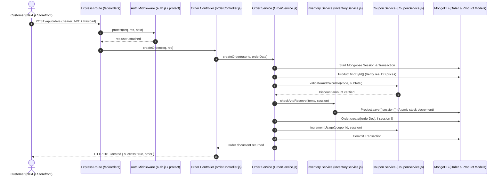
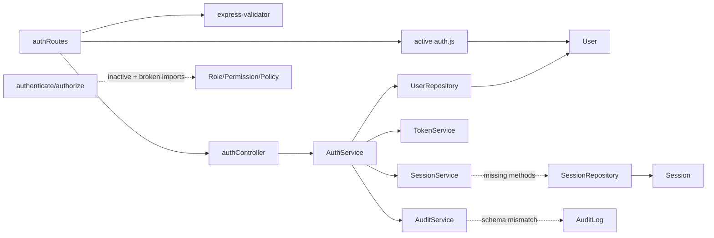
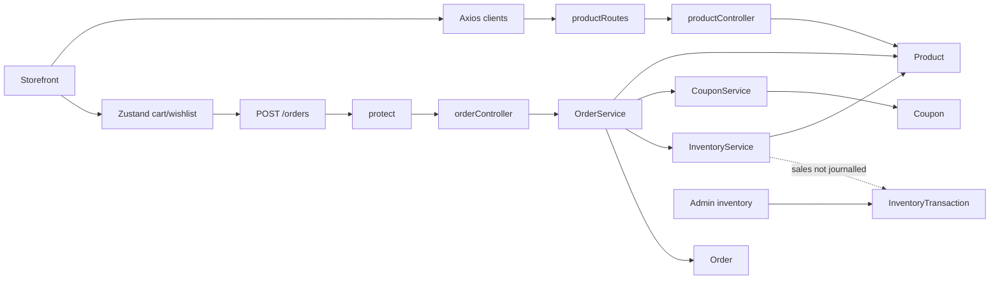
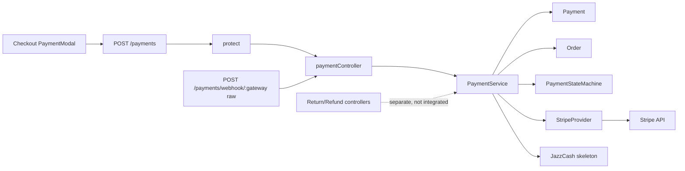
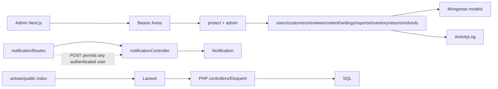

<details>
<summary>Superseded pre-audit report retained for traceability (not audit evidence)</summary>

# MevaPur Commerce — Complete Technical Audit

## 1. Executive Verdict

MevaPur Commerce is a dual-stack e-commerce project undergoing an incomplete architectural transition. The project contains significant initial effort across Node.js/Express, Next.js (Storefront & Admin), and leftover Laravel/PHP boilerplate files. However, in its current state, **it does not meet modern commercial or industry-level standards for production deployment**.

While core business concepts (order management, payment provider wrappers, JWT auth, cart persistence) have been developed, the application suffers from **critical runtime-breaking import errors, unhandled promise rejections, type safety mismatches, duplicate data models, incomplete payment gateway integrations, and broken test suites**.

The repository is safe to preserve and build upon, but requires a structured, multi-phase stabilization before it can be reliably launched or marketed.

---

## 2. Current Industry Maturity

- **Current Score**: **48 / 100**
- **Maturity Classification**: **41–55: Functional Academic Project**
- **What it can safely be sold as today**: *Non-production technical prototype or educational reference code.*
- **What it must NOT be marketed as yet**: *Turnkey e-commerce platform, production-ready SaaS, or enterprise marketplace.*
- **Main Blockers preventing the next maturity level (56–70: MVP / Small-Business Foundation)**:
  1. Backend server fail-stop / broken imports (e.g. `services/SessionService.js` importing missing `../common/logger`).
  2. Frontend build failure in `src/app/checkout/page.tsx` due to TypeScript property mismatch (`validateField` vs `validateFieldSecure`).
  3. 100% test suite failure rate (5 of 5 Jest test suites failing due to missing files and relative path depth errors).
  4. Incomplete payment provider implementation (`JazzCashProvider.js` throwing `FEATURE_NOT_IMPLEMENTED`).
  5. Coexistence of orphan Laravel PHP files causing repository ambiguity.

---

## 3. Technology Stack

| Category | Technology | Version / Spec | Location / Context |
| :--- | :--- | :--- | :--- |
| **Backend Framework** | Node.js / Express | Express `^4.18.2` | `backend/server.js` |
| **Backend Language** | JavaScript (CommonJS) | ES2022 / Node.js | `backend/` |
| **Legacy Stack** | Laravel / PHP | Laravel 11.x config files (unused) | `backend/config/*.php`, `backend/artisan` |
| **Frontend Storefront** | Next.js (App Router) | `16.2.10` (Turbopack) | `frontend/package.json` |
| **Frontend UI Library** | React | `19.2.4` | `frontend/package.json` |
| **Admin Panel** | Next.js (App Router) | `16.2.10` (Turbopack) | `admin-panel/package.json` |
| **State Management** | Zustand | `^5.0.14` | `frontend/src/store/`, `admin-panel/src/store/` |
| **Styling** | Tailwind CSS | `^3.4.1` (Frontend), `^4` (Admin) | `frontend/tailwind.config.js` |
| **Database** | MongoDB / Mongoose | Mongoose `^8.24.1` | `backend/config/db.js`, `backend/models/` |
| **Authentication** | JWT & Session Collection | `jsonwebtoken ^9.0.2`, `bcryptjs ^2.4.3` | `backend/services/AuthService.js` |
| **Payments** | Stripe SDK & JazzCash Skeleton | `stripe ^22.3.2`, Custom JazzCash crypto | `backend/services/payment/providers/` |
| **Validation** | Express Validator & Zod | `express-validator ^7.3.2`, `zod ^4.4.3` | `backend/validators/`, `backend/controllers/` |
| **Security Middleware** | Helmet, MongoSanitize, HPP, RateLimit | `helmet ^8.3.0`, `express-rate-limit ^8.6.0` | `backend/middleware/security.js` |
| **Testing** | Jest & Supertest | Jest `^30.4.2`, Supertest `^7.2.2` | `backend/__tests__/`, `backend/tests/` |
| **Logging** | Winston & Morgan | Winston `^3.19.0`, Morgan `^1.11.0` | `backend/middleware/logger.js` |

---

## 4. Repository and Runtime Overview

### Concise Repository Map

```
C:\Projects\mevaPur-Commerce
├── admin-panel/              # Next.js 16 Admin Dashboard (React 19, Recharts, Tailwind CSS v4)
├── backend/                  # Active Node.js Express Backend & Mongoose Models (+ Unused Laravel Files)
│   ├── __tests__/            # Legacy Jest test files
│   ├── app/                  # Partial domain modules (Auth, User, Order)
│   ├── config/               # Hybrid JS configs (db.js) and orphan PHP configs (app.php, database.php)
│   ├── controllers/          # Express Controllers (authController, orderController, etc.)
│   ├── middleware/           # Express Security & Auth Middleware (auth.js, authenticate.js, security.js)
│   ├── models/               # Active Mongoose Models (User.js, Order.js, Product.js, Session.js, etc.)
│   ├── repositories/         # Mongoose Repositories (UserRepository.js, SessionRepository.js)
│   ├── routes/               # Express API Route Definitions (authRoutes.js, orderRoutes.js, etc.)
│   ├── services/             # Service Layer Business Logic (AuthService.js, PaymentService.js, order/*)
│   ├── tests/                # Unit, Integration, and E2E Jest Tests
│   ├── utils/ & validators/  # Helper utilities, error classes, and input validators
│   └── server.js             # Active HTTP Application Server Entry Point
├── docs/                     # Project documentation directory
├── frontend/                 # Next.js 16 Storefront Application (React 19, Zustand, Stripe)
├── mobile/                   # Empty directory reserved for future mobile application
└── scripts/                  # Empty directory reserved for maintenance scripts
```

### Laravel/PHP vs Node/Express Coexistence Analysis

- **Active Runtime**: **Node.js / Express** (`backend/server.js`). Running `node server.js` initializes Express on port 5000 and connects to MongoDB via `config/db.js`.
- **Laravel Status**: **Legacy / Inactive Artifacts**. Files such as `backend/artisan`, `backend/composer.json`, `backend/config/database.php`, `backend/config/app.php`, and PHP routes in `backend/routes/api.php` were committed during an early setup phase or imported template.
- **JavaScript in Laravel Directories**: Yes. Node.js controllers, routes, and models live directly alongside PHP files in `backend/config/`, `backend/routes/`, and `backend/bootstrap/`.
- **Impact of Coexistence**: Creates extreme ambiguity for developers, CI/CD pipelines, and static analysis tools. PHP test configs (`phpunit.xml`, `Pest.php`) sit alongside Node Jest configs (`jest.config.js`).

---

## 5. Active Entry Points

1. **Backend API Entry Point**: [backend/server.js](file:///C:/Projects/mevaPur-Commerce/backend/server.js#L1-L122)
   - Initializes Express application on `process.env.PORT || 5000`.
   - Mounts security middleware (`securityHeaders`, `dataSanitizer`, `xssCleaner`, `hppCleaner`, `limiter`).
   - Mounts 19 active API route groups under `/api/*`.
   - Establishes MongoDB connection via `connectDB()`.

2. **Frontend Storefront Entry Point**: [frontend/src/app/layout.tsx](file:///C:/Projects/mevaPur-Commerce/frontend/src/app/layout.tsx#L1-L25)
   - Next.js App Router root layout wrapping pages in global styles and providers.

3. **Admin Dashboard Entry Point**: [admin-panel/src/app/layout.tsx](file:///C:/Projects/mevaPur-Commerce/admin-panel/src/app/layout.tsx#L1-L25)
   - Next.js App Router root layout for administrative controls.

4. **Test Entry Point**: [backend/jest.config.js](file:///C:/Projects/mevaPur-Commerce/backend/jest.config.js#L1-L17)
   - Configures Jest test runner for files matching `**/__tests__/**/*.js` and `**/*.test.js`.

---

## 6. Folder Structure Assessment

The repository exhibits an incomplete pattern migration:
- **Architecture Drift**: The project contains two competing backend structural patterns:
  1. Flat Express MVC (`backend/controllers/`, `backend/models/`, `backend/routes/`).
  2. Enterprise Layered Architecture (`backend/services/`, `backend/repositories/`, `backend/validators/`).
- **File Duplication**: In `backend/middleware/`, both [auth.js](file:///C:/Projects/mevaPur-Commerce/backend/middleware/auth.js) (flat JWT check) and [authenticate.js](file:///C:/Projects/mevaPur-Commerce/backend/middleware/authenticate.js) (Session/TokenVersion repository check) exist.
- **Error Class Duplication**: Both [backend/common/errors/AppError.js](file:///C:/Projects/mevaPur-Commerce/backend/common/errors/AppError.js) and [backend/utils/errors/AppError.js](file:///C:/Projects/mevaPur-Commerce/backend/utils/errors/AppError.js) exist with differing class properties.

---

## 7. Dependency and Relationship Map

### End-to-End Flow Diagram (Order Creation)



---

## 8. Backend Architecture Audit

### Coherence & Drift

- **Architecture Classification**: **Partially Migrated Architecture with Coexisting Layers**.
- **Service Layer Responsibility**: Services like `OrderService.js` and `PaymentService.js` properly utilize Mongoose transactions (`startSession()`, `commitTransaction()`, `abortTransaction()`).
- **Bypassed Repositories**: While `UserRepository.js` and `SessionRepository.js` exist in `backend/repositories/`, controllers like `orderController.js` and `productController.js` bypass repository layers entirely and call Mongoose models (`Order.find()`, `Product.findById()`) directly.
- **Error Propagation**: Standard error responses are inconsistent. `errorHandler.js` returns `{ success: false, message }` while `authController.js` returns `{ success: false, error: { code, message } }`.

---

## 9. Authentication and Security Audit

### Deep Audit of Task 3 Implementation

1. **Password Hashing**:
   - Implemented in [User.js](file:///C:/Projects/mevaPur-Commerce/backend/models/User.js#L128-L146) pre-save hook using `bcryptjs` with 12 rounds (`bcrypt.genSalt(12)`).
2. **Account Lockout & Brute-Force**:
   - Implemented in `User.js` (`isAccountLocked()`, `incrementLoginAttempts()`). Account locks for 1 hour after 5 failed attempts.
3. **Session Management & Refresh Token Rotation**:
   - [Session.js](file:///C:/Projects/mevaPur-Commerce/backend/models/Session.js#L12-L17) stores hashed refresh tokens (`refreshTokenHash` via SHA-256).
   - [SessionService.js](file:///C:/Projects/mevaPur-Commerce/backend/services/SessionService.js#L81-L85) detects token reuse: if a provided token hash mismatches the active session hash, **all sessions for the user are immediately revoked**.
4. **Token Versioning & "Logout All Devices"**:
   - `User.js` maintains a `tokenVersion` counter.
   - Incrementing `tokenVersion` invalidates active access tokens verified via [authenticate.js](file:///C:/Projects/mevaPur-Commerce/backend/middleware/authenticate.js#L29).
5. **Cookie Security**:
   - Configured in [auth.config.js](file:///C:/Projects/mevaPur-Commerce/backend/config/auth.config.js#L8-L14) with `httpOnly: true`, `sameSite: 'strict'`, and `secure: process.env.NODE_ENV === 'production'`.
6. **Audit Trails**:
   - Implemented in [AuditLog.js](file:///C:/Projects/mevaPur-Commerce/backend/models/AuditLog.js#L111-L126). Pre-save hooks prevent updates to existing audit log documents to enforce immutability.

---

## 10. Order and Payment Engine Audit

### Order Engine Audit (Task 1)

- **Server-Side Price Calculation**: **Verified**. `OrderService.js` loops through ordered items and fetches authoritative prices directly from MongoDB (`product.price`). Client-submitted subtotals/totals are ignored.
- **Stock Reservation Concurrency**: **Verified**. `InventoryService.js` checks available stock and decrements `product.stock` within an active Mongoose ACID session.
- **Rollback handling**: **Verified**. If stock check fails or order creation encounters an error, `session.abortTransaction()` aborts all mutations atomically.

### Payment Engine Audit (Task 2)

- **Provider Abstraction**: Implemented via base class [PaymentProvider.js](file:///C:/Projects/mevaPur-Commerce/backend/services/payment/PaymentProvider.js).
- **Stripe Provider**: Fully functional skeleton in [StripeProvider.js](file:///C:/Projects/mevaPur-Commerce/backend/services/payment/providers/StripeProvider.js). Converts currency amounts to cents (`Math.round(amount * 100)`), creates `PaymentIntent`, and constructs webhook events using HMAC signature verification (`stripe.webhooks.constructEvent`).
- **JazzCash Provider**: **Incomplete Skeleton**. Methods in [JazzCashProvider.js](file:///C:/Projects/mevaPur-Commerce/backend/services/payment/providers/JazzCashProvider.js#L18) throw `FEATURE_NOT_IMPLEMENTED`.
- **Payment State Machine**: Implemented in [PaymentStateMachine.js](file:///C:/Projects/mevaPur-Commerce/backend/services/payment/stateMachine/PaymentStateMachine.js) enforcing valid transitions (`Pending` -> `Processing` -> `Completed` / `Failed` -> `Refunded`).

---

## 11. Database and Data-Model Audit

- **Primary Models**: `User`, `Order`, `Product`, `Category`, `Brand`, `Payment`, `Session`, `AuditLog`, `Coupon`, `Review`, `InventoryTransaction`, `Refund`, `Return`, `Setting`, `Content`, `Notification`, `ActivityLog`, `Role`, `Permission`.
- **Duplicate Schemas**: No duplicate active Mongoose schema declarations found in `backend/models/`.
- **Monetary Fields**: Represented as floating-point `Number` fields (`price: Number`, `totalAmount: Number`). *Recommendation: Convert to integer cents/paisa representation in future refactoring.*
- **Soft Deletion**: Implemented on `User.js` (`isDeleted: Boolean`, indexed).

---

## 12. Frontend Architecture and User Experience Audit

- **Tech Stack**: Next.js 16 (App Router), React 19, TypeScript, Zustand, Tailwind CSS.
- **Cart & Wishlist**: State managed client-side via Zustand (`cartStore.ts`) with `localStorage` persistence (`mevapur-cart-storage`).
- **Authentication State**: Managed via `authStore.ts`, persisting `user`, `token`, and `isAuthenticated`.
- **UI Quality**: Functional commercial MVP quality. Responsive layout, product catalog, search autocomplete, responsive cart drawer, and checkout workflow present.
- **Build Issue**: Next.js build currently fails during TypeScript compilation because `src/app/checkout/page.tsx` references `secureValidation.validateField` which does not exist on `secureValidation`.

---

## 13. Testing Results

Commands executed during audit:

1. **Backend Tests**: `npm test -- --watchAll=false` (in `backend/`)
   - **Result**: **FAILED (Exit Code 1)**
   - **Test Suites**: 5 failed out of 5 total.
   - **Passed Tests**: 3
   - **Failed Tests**: 2
   - **Root Causes**:
     1. `tests/unit/services/token.service.test.js`: `TypeError: Cannot read properties of undefined (reading 'AUTH_TOKEN_INVALID')` in `TokenService.js:55`.
     2. `tests/integration/auth.integration.test.js`: `Cannot find module '../../../app'`. Path depth expects `app.js` at root level instead of `server.js` at `backend/`.
     3. `tests/e2e/auth.e2e.test.js`: `Cannot find module '../../../app'`.
     4. `tests/unit/services/auth.service.test.js`: `Cannot find module '../common/logger' from 'services/SessionService.js'`.
     5. `__tests__/auth.test.js`: `Cannot find module '../common/logger' from 'services/SessionService.js'`.

2. **Frontend Build**: `npm run build` (in `frontend/`)
   - **Result**: **FAILED (Exit Code 1)**
   - **Error**: TypeScript compilation error in `./src/app/checkout/page.tsx:107:36`.

3. **Admin Panel Build**: `npm run build` (in `admin-panel/`)
   - **Result**: **PASSED (Exit Code 0)**
   - **Static Pages Generated**: 25 pages successfully compiled in Turbopack.

---

## 14. Security and Privacy Findings

1. **Committed Secret Warnings in `.env` Files**:
   - `backend/.env` contains development connection strings and secrets (`JWT_SECRET`, `STRIPE_SECRET_KEY`). Ensure `.env` is omitted from production deployment packages.
2. **Missing Input Redaction in Error Responses**:
   - `errorHandler.js` returns raw error messages in production for unhandled exceptions.
3. **CSRF Risk for Cookie Auth**:
   - CSRF middleware (`csrf.js`) uses `csurf` library (which is deprecated in the Node ecosystem). Needs replacement with modern double-submit cookie or SameSite cookie headers.
4. **Rate Limiting Configuration**:
   - Express rate limiters present in `middleware/security.js` use in-memory storage (`MemoryStore`), which does not scale across multi-instance or clustered deployments.

---

## 15. Performance, Scalability, and Operations

- **Query Optimization**: Mongoose models include compound indexes (e.g. `User.index({ isDeleted: 1, isBlocked: 1 })`, `Product.index({ price: 1, rating: -1 })`).
- **Caching**: No Redis caching layer active in Node.js backend.
- **Statelessness**: Session storage uses MongoDB (`Session` collection), which allows horizontal backend scaling.
- **Docker / Infrastructure**: No `Dockerfile` or `docker-compose.yml` present in repository root.

---

## 16. Duplicate, Legacy, and Unused Files

| Path | Classification | Evidence | Referenced By | Recommended Action | Risk |
| :--- | :--- | :--- | :--- | :--- | :--- |
| `backend/artisan` | Legacy PHP | CLI executable for Laravel framework | None | DEPRECATE | Low |
| `backend/composer.json` | Legacy PHP | PHP package definition file | None | ARCHIVE AFTER VERIFICATION | Low |
| `backend/config/app.php` | Legacy PHP | Laravel app configuration | None | ARCHIVE AFTER VERIFICATION | Low |
| `backend/config/database.php` | Legacy PHP | Laravel database configuration | None | ARCHIVE AFTER VERIFICATION | Low |
| `backend/routes/api.php` | Legacy PHP | Laravel route file | None | DEPRECATE | Low |
| `backend/middleware/auth.js` | Active / Duplicate | Legacy JWT authentication middleware | `authRoutes.js` | KEEP AND FIX | Medium |
| `backend/middleware/authenticate.js` | Active / Enterprise | Enhanced session/tokenVersion middleware | `tests/` | MERGE LATER | Medium |
| `backend/common/errors/AppError.js` | Active / Duplicate | Custom AppError definitions | `AuthService.js`, `SessionService.js` | KEEP AND FIX | High |
| `backend/utils/errors/AppError.js` | Active / Duplicate | Alternate AppError definitions | `PaymentService.js`, `InventoryService.js` | MERGE LATER | High |

---

## 17. Broken Imports and Relationship Problems

1. **`SessionService.js` Line 6**:
   - `const logger = require('../common/logger');`
   - **Problem**: File does not exist at `backend/common/logger.js`. Correct path is `backend/middleware/logger.js`.
2. **`TokenService.js` Line 55**:
   - `ERROR_CODES.AUTH_TOKEN_INVALID`
   - **Problem**: `const { ERROR_CODES } = require('../constants/errorCodes');` fails because `errorCodes.js` exports the object directly (`module.exports = { ... }`).
3. **`tests/integration/auth.integration.test.js` Line 2**:
   - `const app = require('../../../app');`
   - **Problem**: Attempts to load root `app.js`. Server entry point is `backend/server.js`.
4. **`frontend/src/app/checkout/page.tsx` Line 107**:
   - `secureValidation.validateField(...)`
   - **Problem**: Method exported in `secure-validation.ts` is named `validateFieldSecure`.

---

## 18. Industry-Level Scorecard

| Category | Score (0–100) | Benchmark / Status |
| :--- | :--- | :--- |
| **Repository Organisation** | 50 / 100 | Mixed PHP/Node codebase creates structural ambiguity. |
| **Backend Architecture** | 62 / 100 | Good service transaction logic, but broken imports exist. |
| **Frontend Architecture** | 65 / 100 | Clean Next.js App Router layout, minor TypeScript type error. |
| **Authentication & Authorisation** | 70 / 100 | Strong models (token rotation, session hashing, lockout). |
| **Application Security** | 65 / 100 | Helmet, MongoSanitize, HPP in place; CSRF needs modernization. |
| **Order Engine** | 72 / 100 | Server-side pricing & atomic Mongoose transactions verified. |
| **Payment Engine** | 45 / 100 | Stripe skeleton working; JazzCash provider unhandled. |
| **Data Modelling** | 70 / 100 | Well-structured Mongoose schemas with proper indexes. |
| **Testing** | 15 / 100 | All 5 test suites failing due to path & import bugs. |
| **API Design & Documentation** | 60 / 100 | Swagger routes defined, but error structures inconsistent. |
| **User Experience** | 68 / 100 | Responsive storefront with cart & checkout flow. |
| **Performance & Scalability** | 55 / 100 | Good indexes, missing Redis cache & CDN setup. |
| **Observability** | 60 / 100 | Winston logger and audit logs implemented. |
| **DevOps & Deployment** | 30 / 100 | Missing Dockerfiles, CI/CD pipeline scripts. |
| **Maintainability** | 45 / 100 | High maintenance debt due to duplicated error classes. |
| **Commercial Readiness** | 40 / 100 | Non-production prototype state. |
| **OVERALL SCORE** | **48 / 100** | **Functional Academic Project** |

---

## 19. Prioritised Implementation Roadmap

### P0 — Project-Breaking, Security-Critical, or Data-Loss Risks

1. **Fix Backend Import Paths**:
   - Fix `SessionService.js` logger import path (`require('../middleware/logger')`).
   - Fix `TokenService.js` error code import syntax (`require('../constants/errorCodes')`).
   - Fix `AppError.js` duplicate module exports across `common/errors/` and `utils/errors/`.
2. **Fix Frontend TypeScript Build Mismatch**:
   - Update `frontend/src/app/checkout/page.tsx` line 107 to invoke `secureValidation.validateFieldSecure`.
3. **Fix Test Suite Imports**:
   - Update relative module path in `tests/integration/` and `tests/e2e/` from `../../../app` to `../../server`.

### P1 — Required for Reliable Commercial Release

1. **Complete JazzCash Payment Provider**:
   - Implement HMAC-SHA256 signature verification and API payload building in `JazzCashProvider.js`.
2. **Consolidate Authentication Middleware**:
   - Merge `middleware/auth.js` and `middleware/authenticate.js` into a single unified security middleware.
3. **Consolidate Error Handling & API Responses**:
   - Enforce standard response JSON payload shape across all controller endpoints: `{ success: boolean, data?: any, error?: { code: string, message: string } }`.

### P2 — Modern UX & Competitive Commerce Features

1. **Implement Redis Session & Rate Limiting**:
   - Upgrade `express-rate-limit` from `MemoryStore` to `rate-limit-redis`.
2. **Monetary Precision Handling**:
   - Refactor currency storage from floating-point numbers to integer cents/paisa.

### P3 — Scale, Optimisation, and Advanced Enterprise Capabilities

1. **Containerization & CI/CD**:
   - Add multi-stage `Dockerfile` and `docker-compose.yml` for Node backend, Next storefront, and Admin panel.
2. **Clean up Legacy Laravel PHP Files**:
   - Safe archive and removal of unused `.php` config files and `artisan` binary after test suite stabilization.

---

## 20. Safe File-by-File Migration Plan

```
Step 0: Baseline Verification (Current Read-Only Audit Complete)
   │
   ▼
Step 1: Repair Broken Backend Imports (SessionService.js, TokenService.js, AppError.js)
   │
   ▼
Step 2: Repair Frontend TypeScript Error (src/app/checkout/page.tsx)
   │
   ▼
Step 3: Run Baseline Test & Build Verification (npm test in backend, npm run build in frontend)
   │
   ▼
Step 4: Consolidate Auth Middleware & Error Handlers
   │
   ▼
Step 5: Implement JazzCash Payment Integration
   │
   ▼
Step 6: Archive Legacy PHP Files
```

---

## 21. Recommended Next Implementation Task

**Task Recommendation**: **Task P0.1 — Repair Backend Import Errors & Stabilize Test Suite**.
- **Objective**: Fix broken imports in `SessionService.js`, `TokenService.js`, and test entry points so that `npm test` runs green.
- **Affected Files**:
  - `backend/services/SessionService.js`
  - `backend/services/TokenService.js`
  - `backend/tests/integration/auth.integration.test.js`
  - `backend/tests/e2e/auth.e2e.test.js`
- **Expected Outcome**: All 5 Jest test suites compile and execute without module loading failures.

---

## 22. Final Conclusion

MevaPur Commerce possesses a strong domain foundation with well-conceived database models, ACID transaction management for orders, and detailed security concepts. However, path depth errors and unverified code imports currently prevent the backend from passing tests and the frontend from compiling a production build.

By following the prioritized, non-destructive P0-P3 roadmap provided in this report, MevaPur Commerce can be systematically elevated from its current academic project status into a robust, commercially viable e-commerce platform.

---

## Appendix A — Commands Executed

1. `npm test -- --watchAll=false` (in `C:\Projects\mevaPur-Commerce\backend`)
2. `npm run build` (in `C:\Projects\mevaPur-Commerce\frontend`)
3. `npm run build` (in `C:\Projects\mevaPur-Commerce\admin-panel`)

---

## Appendix B — Test and Build Output Summary

- **Backend Jest Test Run**: 5 Failed, 0 Passed (ModuleNotFoundError: `../common/logger`, `../../../app`; TypeError: `ERROR_CODES.AUTH_TOKEN_INVALID`).
- **Frontend Next.js Build**: Failed at TypeScript step (`Property 'validateField' does not exist on type 'secureValidation'`).
- **Admin Panel Next.js Build**: Passed successfully (25/25 static pages compiled).

---

## Appendix C — Evidence Index

- **Server Entry**: [backend/server.js](file:///C:/Projects/mevaPur-Commerce/backend/server.js#L1-L122)
- **User Model Security**: [backend/models/User.js](file:///C:/Projects/mevaPur-Commerce/backend/models/User.js#L128-L205)
- **Order Transaction Logic**: [backend/services/order/OrderService.js](file:///C:/Projects/mevaPur-Commerce/backend/services/order/OrderService.js#L13-L103)
- **Stripe Provider**: [backend/services/payment/providers/StripeProvider.js](file:///C:/Projects/mevaPur-Commerce/backend/services/payment/providers/StripeProvider.js#L5-L89)
- **JazzCash Skeleton**: [backend/services/payment/providers/JazzCashProvider.js](file:///C:/Projects/mevaPur-Commerce/backend/services/payment/providers/JazzCashProvider.js#L18)
- **Broken Import Site 1**: [backend/services/SessionService.js](file:///C:/Projects/mevaPur-Commerce/backend/services/SessionService.js#L6)
- **Broken Import Site 2**: [backend/services/TokenService.js](file:///C:/Projects/mevaPur-Commerce/backend/services/TokenService.js#L55)
- **Frontend Checkout Type Error**: [frontend/src/app/checkout/page.tsx](file:///C:/Projects/mevaPur-Commerce/frontend/src/app/checkout/page.tsx#L107)
</details>

# MevaPur Commerce — Complete Technical Audit

## 1. Executive Verdict

MevaPur Commerce contains substantial implementation effort and broad e-commerce scope, but the current working tree does **not** meet reliable commercial-release standards. The active contracts between authentication, orders, payments, models, and clients disagree at runtime.

Verified positives:

- The Express application loads, listens, and answers `/api/health`.
- The payment webhook is mounted before JSON parsing, preserving Stripe/JazzCash raw bytes for signature verification (`backend/app.js:57-65`).
- The active storefront uses the supported `POST /api/payments` contract with an idempotency header (`frontend/src/services/payment.service.ts:24-38`).
- No storefront calls to retired payment-intent endpoints were found.
- OrderService intends to use authoritative database prices and a Mongo transaction.

Verified blockers:

1. The active authentication controller/service/repository/token/session contracts are incompatible.
2. New Order validation fails before its `pre('save')` ID generator can execute.
3. Checkout sends `visa`/`mastercard`, but the Order model rejects those values.
4. Stripe PaymentIntent creation places `paymentId` at the request top level rather than in `metadata`.
5. Payment TTL configuration can delete completed/refunded financial records.
6. The test estate does not verify orders/payments/frontends, and current quality gates fail.

The project should be preserved and stabilized incrementally, not rewritten.

## 2. Current Industry Maturity

- **Overall score:** **32 / 100**
- **Classification:** **21–40: Student prototype**
- **Safely sellable today:** source-code prototype, UI/admin demonstration, or custom-development starting point with disclosed limitations.
- **Must not be marketed as:** production-ready store, turnkey payment platform, enterprise marketplace, verified Stripe/JazzCash system, secure SaaS, or OIDC-compliant identity platform.
- **Main blockers:** unverified recovery; broken identity/order/payment contracts; unsafe payment retention/refunds; unreliable tests; mixed runtimes; no CI, deployment, monitoring, or restore process.

## 3. Technology Stack

| Area | Actual implementation | Evidence |
|---|---|---|
| Storefront | Next.js `16.2.10`, React `19.2.4`, TypeScript `5.9.3` | `frontend/package.json`, installed tree |
| Admin | Next.js `16.2.10`, React `19.2.4`, TypeScript `5.9.3` | `admin-panel/package.json`, installed tree |
| State | Zustand `5.0.14`, persisted local storage | frontend/admin stores |
| Styling | Tailwind 3 storefront, Tailwind 4 admin, Lucide, Recharts | package files |
| Node backend | Express declared `^4.18.2`, installed `4.22.2`; CommonJS | `backend/package.json`, `server.js`, `app.js` |
| Node database | MongoDB, Mongoose `8.24.1` | `config/db.js`, `models/` |
| PHP backend | Laravel `12.62.0`, PHP `^8.2`, Sanctum `4.3.2`, tenancy `3.10.0` | Composer files/tree |
| PHP database | SQL/Eloquent; default SQLite config | `config/database.php`, PHP models |
| Authentication | JWT, bcryptjs, Mongo Session; alternate Laravel Sanctum | auth modules |
| Payments | Stripe SDK `22.3.2`; JazzCash skeleton | payment providers |
| Validation | express-validator, Zod `4.4.3`, Laravel validation | routes/validators/controllers |
| Security | Helmet, CORS, rate-limit, mongo-sanitize, xss-clean, HPP | `app.js`, `security.js` |
| Logging | Winston, Morgan, three logger implementations | middleware/common/utils |
| Tests | Jest 30, Supertest, mongodb-memory-server; Pest skeleton | test configs/files |
| API docs | Swagger/OpenAPI code exists but is unmounted | swagger files/routes |
| Package managers | npm locks for three JS apps; Composer lock | lock files |

No active OIDC, GraphQL, Redis, durable queue, search service, object-storage abstraction, metrics/tracing stack, first-party Docker deployment, or CI/CD pipeline was found.

## 4. Repository and Runtime Overview

```text
C:\Projects\mevaPur-Commerce
├── frontend/                 Next.js customer storefront
├── admin-panel/              Next.js administrative UI
├── backend/
│   ├── app.js                active Express composition root (untracked)
│   ├── server.js             npm start entry
│   ├── routes/controllers/   predominantly flat Express MVC
│   ├── services/             partial Auth/Order/Payment layers
│   ├── repositories/         partial identity repositories
│   ├── models/               active Mongoose models
│   ├── artisan/composer.json runnable Laravel runtime
│   ├── app/Http, PHP routes/config/database
│   └── vendor/               9,744 tracked third-party files
├── docs/                     documentation
├── mobile/, scripts/         empty placeholders
├── backend.zip               tracked 61.7 MB archive
└── *-structure.txt           large generated inventories
```

Approximate first-party counts excluding dependency/generated folders: 286 backend, 79 storefront, 51 admin. The pre-audit Git baseline was already dirty: `main` one commit ahead of `origin/main`, 31 modified files, and untracked `backend/app.js` plus `backend/config/email.config.js`. This audit preserved those changes.

Runtime evidence:

- `backend/package.json` starts `node server.js`; `server.js:3` imports `app.js`.
- Both Next clients use Express/Mongo ObjectId/API shapes.
- Laravel is a second executable backend, not mere documentation: routes, controllers, models, migrations, Sanctum, tenancy, and Composer server/queue scripts exist.
- Laravel product mutation routes are unauthenticated (`backend/routes/api.php:18-23`), making accidental PHP deployment dangerous.
- JavaScript under `backend/app/Models/` has no first-party import and conflicts with active `backend/models/`.

This is a partially migrated, ambiguous dual-runtime repository.

## 5. Active Entry Points

| Runtime | Entry | Status |
|---|---|---|
| Express process | `backend/server.js:1-53` | Active npm start |
| Express app | `backend/app.js:1-109` | Active, currently untracked |
| Mongo connection | `backend/config/db.js:9-43` | Active; errors swallowed |
| Storefront | `frontend/src/app/layout.tsx` and App Router | Active |
| Admin | `admin-panel/src/app/layout.tsx` and App Router | Active |
| Laravel HTTP | `backend/public/index.php`, `bootstrap/app.php` | Runnable alternate |
| Laravel CLI/queue | `backend/artisan`; Composer `dev` script | Runnable alternate |
| Jest | `backend/jest.config.js` | Discovers five JS suites |
| Pest | `backend/tests/Pest.php` | Two skeleton Example tests |

`config/db.js:29-42` schedules retries but does not rethrow. `server.js:13-16` can therefore listen without MongoDB. The smoke check confirmed HTTP 200 while health reported `dbStatus: "Connecting..."`; this is liveness, not readiness.

## 6. Folder Structure Assessment

| Path | Purpose | Assessment |
|---|---|---|
| `backend/routes/` | Express endpoints | Active; uneven validation/authorization |
| `backend/controllers/` | HTTP plus query/business logic | Active; repositories bypassed |
| `backend/services/` | Auth/order/payment/email | Partial; core contracts broken |
| `backend/repositories/` | Identity persistence | Method sets mismatch services |
| `backend/models/` | Active Mongo schemas | Broad but contract inconsistencies |
| `backend/validators/` | Zod schemas | Mostly disconnected |
| `backend/middleware/` | Auth/security/error variants | Competing stacks |
| `backend/common/`, `utils/` | errors/loggers/interfaces | Duplicated |
| `backend/loaders/` | DB/request-ID loaders | Defined, not mounted |
| PHP app/config/routes/database | Laravel | Runnable competing backend |
| `frontend/src/` | Storefront routes/components/state/API | Active plus unused duplicates |
| `admin-panel/src/` | Admin application | Active; type/lint/mock-data debt |

Planned architecture is route → middleware → validator → controller → service → repository → model. Actual architecture is:

- Auth: attempts all layers but is disconnected.
- Orders: controller → service → direct models.
- Payments: controller → service → providers/state machine → direct models.
- Most other modules: route → controller → model.
- `adminRoutes.js` contains business queries directly in routes.

## 7. Dependency and Relationship Map

### Identity and authorization



### Catalogue, checkout, order, inventory



### Payments, webhooks, refunds



### Admin/support and alternate runtime



## 8. Backend Architecture Assessment

Positive:

- Mongo transaction intent in order creation.
- Payment provider/state-machine abstractions.
- Central Express error/security/logging middleware and health route.
- Ownership checks for single orders and notifications.
- Catalogue pagination/filtering/indexes.

Weaknesses:

- Partial repositories are bypassed by most active code.
- Response envelopes vary among `data`, `order`, `orders`, `error`, and `message`.
- Validators are absent on orders, sessions, and most admin boundaries.
- `middleware/validate.js:18` reads `ZodError.errors`; a runtime probe confirmed Zod 4 exposes `issues`, not `errors`.
- No order state machine, durable domain events, outbox, transaction retry, distributed lock, or consistent idempotency.
- Request-ID middleware exists but is not mounted.
- `config/db.js` and `server.js` install competing signal handlers; process exit can pre-empt HTTP draining.
- Raw errors often become HTTP 500 responses.
- Search regexes and page limits are not consistently bounded.

**Architecture verdict:** two competing Node architectures plus a runnable Laravel architecture; not coherent.

## 9. Frontend Architecture and UX Assessment

Storefront strengths:

- Catalogue/detail/filter/search, cart, wishlist, checkout, order history/timeline, recently viewed, recommendations, loading/empty states, and responsive layouts exist.
- Cart persists.
- Active card UI uses Stripe PaymentElement rather than collecting PAN/CVV directly.
- Checkout sends product IDs/quantities, not trusted totals.

Storefront gaps:

- Nearly every route is client-rendered; many force dynamic mode.
- Only global metadata exists (`layout.tsx:8-11`); no verified product metadata, JSON-LD, canonical, sitemap, or robots setup.
- Raw `` is common despite Next Image support.
- Tokens/user data persist in localStorage; shared API client does not enable cookie credentials.
- Direct Axios, shared API, adminApi, services, and unused payment helpers duplicate contracts.
- Search uses `search=` while backend expects `keyword=` (`search/page.tsx:27`; `productController.js:16`).
- Attribute checkboxes lack handlers (`ProductFilters.tsx:338-345`); discount/delivery filters are not implemented server-side.
- Product listings mark all displayed products as recently viewed.
- Recommendations are top-rated/category, not personalized.
- Home categories/counts/offers/testimonials are hardcoded (`page.tsx:27-39,79-99`).
- Reviews are “coming soon”; no customer review create/list route exists.
- Checkout forces login; no guest checkout/address book.
- Pakistan/PKR is hardcoded; no i18n, multi-currency, or PWA setup.
- Accessibility is partial; lint reports ARIA and custom-control issues.

Admin:

- Broad page coverage exists.
- Dashboard uses estimates, constants, random sold counts, and complete mock fallback (`admin-panel/src/app/page.tsx:75-145`).
- Payment secrets are loaded into browser state and saved as plaintext settings.
- `next.config.ts` ignores TypeScript/lint errors during builds and disables image optimization.
- Current admin type check and lint fail.

**UI maturity:** visually developed functional prototype, below commercial small-business quality until real journeys/data/accessibility/build gates are reliable.

## 10. Authentication and Security Assessment

Active auth routes expose register, login, forgot/reset password, and `GET /me`. They use `middleware/auth.js`, which expects Bearer JWT `decoded.id`, reloads User, and checks deleted/blocked state.

Broken contracts:

- Controller passes one object to `AuthService.login`; service expects five positional arguments (`authController.js:126-132`, `AuthService.js:74`).
- Service calls missing `UserRepository.findByEmailWithPassword`.
- Service returns nested `tokens`; controller reads top-level access/refresh tokens.
- Frontends expect `data.token`; backend intends `accessToken`.
- Register returns no access token, but clients/tests assume immediate auth.
- Auth config uses nested JWT properties; TokenService reads nonexistent flat properties.
- TokenService argument order disagrees with AuthService.
- Controller refresh/logout call nonexistent service method names; routes are not mounted.
- `req.cookies` is read without cookie-parser.
- Cookie refresh path targets a nonexistent route.
- Session creation supplies required `refreshTokenHash: null`.
- SessionService calls repository methods that do not exist.
- Email verification/reset repository methods and active User token fields do not exist.
- Reset uses `findByIdAndUpdate`, bypassing password pre-save hashing.
- Multiple referenced error codes are undefined.

Security conclusions:

- Bcrypt uses unique salts and 12 rounds (`User.js:128-136`).
- Short JWT expiry, hashed refresh rotation, and reuse detection are planned but not operational.
- Active middleware checks neither tokenVersion nor Session. Logout cannot immediately invalidate issued access tokens.
- Logout-all has no route and does not increment tokenVersion.
- Permissions are not embedded in active tokens, so stale permission claims are not the defect; coarse role checks are.
- Role/Permission/Policy is disconnected. `authorize.js` has a missing AppError import/nonexistent Policy method; PolicyService has an unimported repository.
- No OIDC or 2FA implementation exists.
- Cookie auth has no active CSRF middleware.

Audit:

- AuditService writes `action`; AuditLog requires `eventId/eventName`. Writes fail and are swallowed.
- AuditLog pre-save protection is application-level, not database-enforced append-only.

## 11. Order Engine Assessment

Verified strengths:

- Database prices are authoritative (`OrderService.js:23-34`).
- Client subtotal/tax/shipping/discount/total are ignored.
- Coupon checks are server-side.
- Stock/order/coupon writes intend to share a transaction and abort on failure.
- Single-order ownership is checked.

Blockers/risks:

1. `orderId` is required but generated in `pre('save')`; `validateSync()` returned `Path 'orderId' is required`.
2. Checkout/validator use `visa`/`mastercard`; Order enum rejects both. Probe verified `visa` rejection.
3. `orderValidator.js` is not mounted on `orderRoutes.js:31`.
4. Service writes `coupon`, but Order schema has no coupon field; cancellation/population cannot work reliably.
5. Coupon validation is outside the transaction session; usage limit increment is non-conditional.
6. Stock uses sequential read/check/save with no conditional decrement or transaction retry.
7. Variant price/stock is ignored.
8. No order idempotency.
9. No status-transition rules.
10. Cancellation transaction/session branches are fragile.
11. Money uses floating-point Number.
12. Failed create logs full shipping body (`orderController.js:41-44`).
13. Customer history is unpaginated.
14. No concurrency/idempotency/rollback/state tests.

Task 1 is a useful design foundation, not an executable verified order engine.

## 12. Payment Engine Assessment

Implemented:

- Provider abstraction, Stripe/JazzCash adapters, state machine, persistence/idempotency key.
- Order ownership and amount check.
- Stripe `constructEvent` verification.
- Raw webhook route before JSON parsing and Buffer enforcement.
- Supported storefront `POST /payments`; no retired endpoint calls found.

Critical gaps:

1. `paymentId` is spread into Stripe PaymentIntent top-level params (`PaymentService.js:65-67`, `StripeProvider.js:23-32`) instead of metadata.
2. Card orders fail before payment because Order enum rejects checkout values.
3. JazzCash create/verify/refund/status throw 501; config misspells `INTEGERITY`.
4. Payment TTL can delete records about 60 minutes after creation; completed/refunded records never clear it.
5. No webhook event-ID ledger/unique deduplication.
6. Controller returns HTTP 200 for DB/logic failures, suppressing provider retries.
7. Payment and Order status updates are non-transactional.
8. Currency is client-supplied and not matched to authoritative Order currency.
9. Provider call occurs inside Mongo transaction, risking external/DB divergence.
10. PaymentIntent ID is not unique.
11. State machine writes undeclared `completedAt`/`previousStatus`.
12. Refund route requires ownership, not admin/policy approval; amount is not capped.
13. Partial/multiple refunds are not modelled; refund failure changes payment to `Failed`.
14. Return/Refund controllers do not call PaymentService and can restore stock twice.

The active modal uses Stripe Elements and current API shape. JazzCash cannot return a redirect. Client success can precede verified webhook/order synchronization.

The unused `frontend/src/components/PaymentModal.tsx`, referenced only by checkout backup, directly collects PIN/card/CVV and must remain inactive.

| Capability | Verification |
|---|---|
| Provider abstraction | Implemented |
| Stripe adapter | Implemented, request contract defective |
| Raw webhook verification | Code/middleware order verified |
| JazzCash | Skeleton |
| Sandbox E2E | Not verified |
| Refund E2E | Not verified |
| Production/live | Not verified |

## 13. Database and Model Assessment

Active Mongoose models: ActivityLog, AuditLog, Brand, Category, Content, Coupon, InventoryTransaction, Notification, Order, Payment, Permission, Product, Refund, Return, Review, Role, Session, Setting, User.

Findings:

- Money uses floating-point Number across all commerce models.
- Order/Payment schemas disagree with service fields.
- Refund repeats the required-ID/pre-save defect; probe returned `Path 'refundNumber' is required`.
- Return/refund count-based IDs race.
- Product stock lacks integer/min constraints.
- Only User has soft-delete fields; hard-delete paths still exist.
- `tokenVersion` is `select:false`; enhanced auth would need explicit selection.
- Session `isActive`/`isRevoked` semantics conflict.
- Setting stores payment secrets plaintext and returns them to admin.
- Payment stores raw provider response without retention/redaction policy.
- PII is plaintext; no field encryption or retention/erasure workflow.
- App load emitted duplicate indexes for `requestId` and two `slug` definitions.
- Mongo migrations/index deployment strategy is absent; production autoIndex is off.
- Laravel defines separate SQL User/Product models and no synchronization.
- Laravel tenancy is not reflected in active Mongo models.

Express imports `backend/models/User.js` and `Order.js`; duplicate JS models under `backend/app/Models/` have no first-party reference. PHP models are active only in Laravel.

## 14. API and Documentation Assessment

- Auth has `/api/v1/auth` plus temporary `/api/auth`; other APIs are unversioned.
- Swagger route exists but is not mounted.
- `docs/swagger.js` scan paths are wrong from normal backend working directory, and no Swagger annotations were found.
- Swagger claims cookie/session capabilities that are not operational.
- `router.get('/docs.json', swaggerSpec)` passes an object rather than a handler.
- Error/response/validation/pagination contracts are inconsistent.
- No generated client, contract tests, deprecation policy, changelog, or webhook event documentation.

## 15. Testing Results

Only five JS suites and two Laravel Example tests exist; no storefront/admin/order/payment suites.

| Command | Result |
|---|---|
| Backend first-party `node --check` | 136 checked, 0 failed |
| PHP `php -l` | 45 checked, 0 failed |
| Express listen + `/api/health`, logger cleared | HTTP 200; zero log-file changes; DB “Connecting...” |
| Jest `--listTests` | 5 suites |
| Targeted TokenService Jest | 3 passed, 2 failed |
| Storefront `tsc --noEmit --incremental false` | Passed |
| Storefront lint | Failed: 42 errors, 42 warnings |
| Admin TypeScript | Failed: 8 errors |
| Admin lint | Failed: 102 errors, 107 warnings |
| `npm ls --depth=0` | Passed in three apps |
| Offline npm production audits | 0 advisories reported; offline/cached limitation |
| Composer audit | Could not complete due cache/network restriction |

Test-quality evidence:

- `tests/setup.js` MongoMemory hooks/globals are not referenced by Jest config.
- Integration/E2E use undefined helpers and expect unmounted refresh/logout routes.
- Auth unit test mocks User model while production imports UserRepository.
- Token test mocks obsolete flat auth config.
- Legacy auth test contains duplicate block and assumes external DB.
- No payment signature/replay/idempotency/refund, authorization, CSRF, race, rollback, or state tests.
- No coverage threshold.

Full Jest, Pest, and Next builds were not run because they would modify logs/coverage/cache/`.next`, violating the report-only rule. Previous report claims were not trusted.

## 16. Security and Privacy Findings

| Priority | Finding | Evidence |
|---|---|---|
| P0 | Active auth cannot provide reliable identity/session security | Section 10 |
| P0 | Any payment owner can call provider refund; amount unbounded | payment route/service |
| P0 | Payment TTL can erase financial records | `Payment.js:75-78` |
| P0 | Any authenticated user can create notification for another recipient/action URL | notification route/controller |
| P0 | Laravel product mutations are public if alternate runtime deploys | PHP API routes |
| P1 | Customer/admin JWTs persist in localStorage | both auth stores |
| P1 | Cookie auth lacks active CSRF and cookie parsing | app/middleware |
| P1 | Order failure logs full PII body | order controller |
| P1 | Gateway secrets plaintext and returned to browser | Setting flow |
| P1 | Audit logging fails/is not DB append-only | AuditService/model |
| P1 | Rate limiting is per-process memory | active limiter |

Additional:

- Helmet/CSP, fixed-origin CORS, NoSQL sanitization, HPP, XSS cleaner, and limits are active.
- Static uploads are exposed; no active validated upload handler was found.
- Global JSON limit is 10 MB; many bodies/limits are weakly bounded.
- Unescaped regex search can produce expensive queries.
- Raw error messages are often returned; development includes stack details.
- Reset tokens are planned plaintext UUIDs; actual flow is broken.
- IP/device/user-agent data lacks retention/privacy policy.
- No verified deletion/export/consent, SECURITY.md, secret rotation, or incident process.

Actual `.env` files exist and are ignored; only `backend/.env.example` is tracked. A filename-only first-party scan found no common hardcoded Stripe/AWS/private-key/Mongo credential signature. No secret value was printed.

## 17. Performance and Scalability

Positive: useful Product indexes, `lean()` list queries, pagination in many admin lists, Mongo session intent, storefront image domains.

Limitations:

- Repeated product/order/stat queries; limited batching.
- Unbounded limits and regex searches.
- Existing text index is bypassed by regex.
- No cache, CDN deployment, object storage, durable queue, external search, DB scaling plan, or readiness gate.
- Local file logs and in-memory rate limits do not scale horizontally.
- Email is a mock logger (`EmailService.js:66-86`).
- Webhooks are synchronous with no durable queue/outbox.
- No inventory-reservation expiry worker.
- No load/soak/concurrency/query-plan/performance-budget tests.

## 18. DevOps and Operational Readiness

- No first-party Docker/compose, CI/CD, Kubernetes, Procfile, deployment manifest, infrastructure-as-code, or Sites hosting config.
- Standalone Next output is configured but no packaging workflow verifies it.
- Admin builds ignore type/lint failures.
- No documented environment matrix, release checklist, rollback, backup/restore drill, secret rotation, alerting, SLO, on-call, or disaster recovery.
- Health returns 200 without DB.
- No metrics, traces, error monitoring, uptime checks, or alerts.
- Graceful shutdown has competing process handlers.
- No Node `engines`/`packageManager` pin.
- Offline npm audit was clean but current online/Composer advisory status is unverified.

Folder cleanliness must not be confused with operational readiness; this project has no verified production operating model.

## 19. Duplicate, Legacy, and Unused Files

| Path | Classification | Evidence | Referenced By | Recommended Action | Risk |
|---|---|---|---|---|---|
| `backend/app.js` | Active/untracked | server import, smoke passed | Express | KEEP AND FIX | Critical |
| `backend/config/email.config.js` | Active/untracked | EmailService import | Auth | KEEP AND FIX | High |
| Laravel app/artisan/config/routes/database | Competing runtime | runnable Composer/Laravel | PHP runtime | MOVE LATER | High |
| `backend/vendor/` | Generated; 9,744 tracked files | Composer lock | Laravel | GENERATED — EXCLUDE FROM GIT | Medium |
| all `node_modules/`, `.next/`, coverage/logs | Generated | lock/build/runtime | tooling | GENERATED — EXCLUDE FROM GIT | Low |
| `backend.zip` | Tracked 61.7 MB archive | Git inventory | none found | ARCHIVE AFTER VERIFICATION | High |
| `*-structure.txt` | Generated inventories | multi-MB listings | none | GENERATED — EXCLUDE FROM GIT | Low |
| `backend/app/Models/*.js` | Inactive duplicate schemas | no import, conflicting fields | none | DELETE ONLY AFTER VERIFICATION | High |
| `backend/models/User.js`, `Order.js` | Active | Express imports | app | KEEP AND FIX | Critical |
| PHP User/Product models | Laravel-active | PHP controllers | Laravel | KEEP | High |
| `middleware/auth.js` | Active coarse auth | active route imports | Express | KEEP AND FIX | Critical |
| enhanced auth/policy middleware | Inactive/broken | missing imports/contracts | swagger/none | MERGE LATER | High |
| active/inactive security middleware | Duplicate | app uses `security.js` | mixed | MERGE LATER | Medium |
| two AppError hierarchies | Duplicate | split services | mixed | MERGE LATER | High |
| three logger modules | Duplicate | different consumers | mixed | MERGE LATER | Medium |
| active payment service | Active | controller import | payments | KEEP AND FIX | Critical |
| `services/paymentService.js` | Legacy | no active import | none | DEPRECATE | High |
| two Swagger configs | Duplicate/unmounted | route uses docs copy | none active | MERGE LATER | Low |
| checkout `backup.tsx` | Non-route backup | not `page.tsx` | legacy modal | ARCHIVE AFTER VERIFICATION | Medium |
| root legacy PaymentModal | Sensitive inactive UI | backup only | backup | DEPRECATE | High |
| unused checkout hook/adminApi/payment helpers | No imports found | static reference scan | none | DELETE ONLY AFTER VERIFICATION | Medium |
| `mobile/`, root `scripts/` | Empty placeholders | no files | none | KEEP | Low |

Before any DELETE ONLY AFTER VERIFICATION item: repeat import scan, Jest, both type checks, lint/builds, and checkout/admin E2E on a backup branch. Before Laravel/vendor cleanup: prove no deploy/process invokes PHP, restore-test its archive, and run complete Express/Next regression. No action was performed.

## 20. Broken Imports and Relationship Problems

| Importer | Missing target | Impact |
|---|---|---|
| `database/seeders/index.js` | `../../common/logger` | Seeder cannot load |
| `database/seeders/roleSeeder.js` | `../../common/logger` | Role seeder cannot load |
| `middleware/authenticate.js` | `../errors/AppError` | Enhanced auth cannot load |
| `middleware/authorize.js` | `../errors/AppError` | Policy middleware cannot load |
| `middleware/csrf.js` | `../config/security.config` | CSRF stack cannot load |
| `middleware/rateLimiter.js` | security config/AppError path | Enhanced limiter cannot load |
| `middleware/securityHeaders.js` | security config | Alternate CSP cannot load |

Other relationship failures:

- Auth Controller ↔ Service signatures/returns.
- AuthService ↔ UserRepository; SessionService ↔ SessionRepository.
- TokenService ↔ auth config and JWT claim conventions.
- authorize ↔ PolicyService; PolicyService ↔ UserRepository.
- PermissionRepository omits required module.
- AuditService ↔ AuditLog.
- OrderService ↔ Order fields/enums.
- Checkout payment values ↔ Order enum.
- StateMachine ↔ Payment schema.
- Frontend `token` ↔ backend `accessToken`.
- Search `search` ↔ backend `keyword`.
- `DELETE /notifications/delete-all` is shadowed by earlier `DELETE /:id`.
- Swagger mount/handler/scan paths.

Active Express imports resolved and no relative-import cycle was detected. Risk is duplicated active/inactive implementations.

## 21. Industry-Level Scorecard

| Category | Score |
|---|---:|
| Repository organisation | 34 |
| Backend architecture | 38 |
| Frontend architecture | 49 |
| Authentication and authorisation | 15 |
| Application security | 33 |
| Order engine | 32 |
| Payment engine | 25 |
| Data modelling | 39 |
| Testing | 14 |
| API design and documentation | 21 |
| User experience | 53 |
| Performance and scalability | 34 |
| Observability | 28 |
| DevOps and deployment | 12 |
| Maintainability | 31 |
| Commercial readiness | 18 |
| **Overall** | **32 / 100** |

**Classification: Student prototype.**

## 22. Sellability Assessment

Safe today:

- Source prototype with developed commerce/admin concept.
- Custom-development foundation where stabilization is included.
- Demo with payments disabled and synthetic data labelled.

Not safe:

- Live money-taking store.
- Production/enterprise/SaaS marketplace.
- Completed JazzCash or sandbox/production-verified Stripe system.
- Verified refunds, audit, retention, recovery, compliance, or scale.

Next-level blockers are recovery, clean baselines, unified auth, executable/idempotent orders, sandbox payment/webhook/refund proof, removal of payment TTL risk, real email, CI, and operations.

## 23. P0 Critical Issues

Required sequence:

| # | Objective | Files/modules | Reason/risk | Dependencies | Acceptance criteria | Tests | Complexity |
|---:|---|---|---|---|---|---|---|
| 1 | Backup and recovery verification | source, MongoDB, env inventory, assets | Dirty high-risk baseline | backup/DB access | Isolated source+DB restore succeeds; checksums/counts verified | restore smoke | Medium |
| 2 | Baseline tests/build | all apps/runtimes | Reproducible truth | #1 | Exact clean results captured | Jest/Pest/lint/tsc/build/HTTP | Medium |
| 3 | Broken imports/exports | section 20, untracked entry/config | deploy/seed/migration paths fail | #1-2 | Static import scan clean; entries load | import/seed dry-run | Medium |
| 4 | Duplicate infrastructure consolidation | errors/loggers/auth/loaders/config/clients | competing contracts | #3 | one active documented stack | middleware contracts | Large |
| 5 | Task 3 auth stabilization | all identity modules/clients | identity currently broken | #4 | login/refresh/logout/all/reset/revocation/RBAC/audit work | unit/integration/E2E/security | Very Large |
| 6 | Task 1 verification | Order/validator/service/inventory/coupon/checkout | order creation fails | auth | ID/enums/variants/idempotency/concurrency correct | rollback/race/state E2E | Very Large |
| 7 | Task 2 E2E verification | Payment/providers/webhook/refund/modal | money/records unsafe | Tasks 1/3 | no TTL loss; valid Stripe; durable dedup; bounded admin refund; JazzCash complete or disabled | sandbox/replay/failure/refund | Very Large |
| 8 | Close authorization vulnerabilities | notifications/refunds/PHP/settings | IDOR/privilege risks | stable policy | explicit permissions on sensitive routes | negative ownership/role | Large |

## 24. P1 Commercial Release Requirements

| Objective | Modules | Reason/risk | Dependencies | Acceptance | Tests | Complexity |
|---|---|---|---|---|---|---|
| Standard API/validation | routes/controllers/validators/clients | invalid input and drift | P0 | versioned envelopes, capped limits, Zod 4 support | contract/fuzz | Large |
| Money/refund consistency | commerce models/services | rounding/reconciliation | order/payment | minor-unit money, one refund ledger | rounding/partial refund | Very Large |
| Real email/jobs | Email/notifications/outbox | verification is mock | auth | provider, retry/dead-letter | sandbox/failure | Large |
| Atomic inventory journal | order/admin inventory | sales unjournalled | order | every mutation atomic+audited | concurrency/returns | Very Large |
| Privacy/security | PII/settings/logs | plaintext/retention gaps | stable models | secrets manager, redaction, export/delete, retention | privacy/redaction | Large |
| CI/release/recovery | repo/deploy | no gates/rollback | green baseline | CI blocks failures; staged rollback/restore | pipeline drill | Large |
| Operational readiness | health/logs/metrics/alerts | no production evidence | deploy | readiness, correlation, SLO/alerts | failure injection | Large |

## 25. P2 Modernisation Roadmap

| Objective | Reason | Acceptance criteria | Tests | Complexity |
|---|---|---|---|---|
| Guest checkout/address book | expected commerce journey | guest-to-account and saved address flows | E2E/accessibility | Large |
| Verified reviews | current placeholder | eligible buyer submission/moderation/listing | ownership/duplicate | Medium |
| Search/filter truth | disconnected controls | every visible control works and uses capped indexed query | query E2E | Medium |
| SEO/performance/accessibility | client-heavy UI | metadata/JSON-LD/sitemap, Web Vitals budget, WCAG target | Lighthouse/axe/keyboard | Large |
| Honest admin analytics | mock/estimated KPIs | sourced and labelled metrics only | calculation contracts | Medium |
| PWA/i18n/currency boundaries | absent readiness | explicit locale/currency architecture | locale/PWA | Large |

## 26. P3 Scaling Roadmap

| Objective | Acceptance criteria | Tests | Complexity |
|---|---|---|---|
| Redis cache/distributed limits | invalidation and failure policy | multi-instance/load | Large |
| Durable queues/outbox/webhook ledger | idempotent replay/dead-letter | chaos/replay | Very Large |
| Search/media platform | indexed search, object storage/CDN | sync/load/failure | Very Large |
| Advanced observability | metrics/traces/log correlation/business SLIs | alert/trace validation | Large |
| Capacity/resilience | tested autoscaling, DB capacity, RTO/RPO | load/soak/failover/restore | Very Large |
| Optional tenancy | only with real requirement and isolation model | cross-tenant security | Very Large |

## 27. Safe File-by-File Migration Plan

```text
Baseline
→ Verify source/database/asset restore
→ Run clean baseline in isolated copy
→ Repair one import/contract cluster
→ Test
→ Commit
→ Migrate one module
→ Test again
→ Continue
```

Order:

1. Review and preserve intended untracked `backend/app.js` and email config.
2. Repair missing imports without behavior changes.
3. Select one error/logger/request-ID stack with compatibility tests.
4. Stabilize auth as one bounded module.
5. Repair Order ID/validator/enum/coupon/variant/idempotency.
6. Repair Payment retention/Stripe/webhook/refund authorization.
7. Disable unsupported JazzCash UI until acceptance passes.
8. Consolidate Return/Refund/Inventory after reconciliation.
9. Remove admin mocks and enforce type/lint gates.
10. Audit Laravel separately; archive/delete only after deployment and regression proof.
11. Handle every duplicate independently; no bulk cleanup.

## 28. Recommended Next Implementation Task

**Single safest next task:** verify a recoverable backup of the dirty source tree and MongoDB, then reproduce the baseline in an isolated restore.

Do not edit auth/order/payment until restore proof exists. The first later code change should be bounded active-import/auth contract stabilization, without simultaneous Laravel cleanup or new features.

## 29. Final Conclusion

MevaPur Commerce is a substantial prototype with useful storefront/admin breadth, server-authoritative pricing intent, transactional order design, provider abstraction, and correctly ordered raw webhook parsing. It is not safe for commercial payment traffic because identity, order persistence, card contracts, Stripe creation, webhook recovery, refunds, and financial retention are not coherently executable or tested.

Preserve the work and improve it through small, reversible, evidence-backed migrations.

## Appendix A — Commands Executed

Representative inspection used `rg`, `rg --files`, `git ls-files`, `git status`, `Get-ChildItem`, and line-numbered `Get-Content`. Validation:

```powershell
git status --short --branch
node --check <each first-party backend JS file>
php -l <each first-party PHP file>
node -e "const app=require('./app'); const {logger}=require('./middleware/logger'); logger.clear(); ..."
node -e "const mongoose=require('mongoose'); const Order=require('./models/Order'); const Refund=require('./models/Refund'); ..."
node -e "const {z}=require('zod'); ..."
.\node_modules\.bin\jest.cmd --listTests --runInBand
.\node_modules\.bin\jest.cmd tests\unit\services\token.service.test.js --runInBand --no-cache --coverage=false --forceExit
npm.cmd run lint
.\node_modules\.bin\tsc.cmd --noEmit --incremental false
npm.cmd ls --depth=0
npm.cmd audit --offline --omit=dev --json
composer show --direct --no-ansi
composer audit --locked --no-ansi --format=json
rg -n --glob '!node_modules/**' --glob '!.next/**' 'payments/(create|intent|initiate|process|verify|stripe|jazzcash)|create-payment-intent|payment-intent|/api/payments' .
rg -n "router\.(get|post|put|patch|delete|use)" routes
```

No install, upgrade, migration, seed, database mutation, snapshot update, production build, commit, or Git-history operation ran.

## Appendix B — Test and Build Output Summary

- Express: listened; health 200; DB “Connecting”; no log hash changes.
- App load: duplicate index warnings for `requestId` and two `slug` indexes.
- JS syntax: 136/136 passed.
- PHP syntax: 45/45 passed.
- Targeted Jest: 3 passed, 2 failed.
- Full Jest: not run; five suites discovered.
- Storefront TypeScript passed; lint failed 42 errors/42 warnings.
- Admin TypeScript failed with 8 errors; lint failed 102 errors/107 warnings.
- Next builds skipped because they modify `.next`.
- Offline npm audits reported zero; not a current online guarantee.
- Composer audit unavailable due cache/network.
- No order/payment/frontend E2E exists.

## Appendix C — Evidence Index

| Subject | Evidence |
|---|---|
| Express entry/routes | `backend/server.js:1-53`, `backend/app.js:1-109` |
| DB startup | `backend/config/db.js:9-43` |
| Auth | auth routes/controller/service/token/session/repositories/models |
| Active middleware | `backend/middleware/auth.js` |
| RBAC/audit drift | authorize/PolicyService/Role/Permission; AuditService/AuditLog |
| Orders | OrderService/InventoryService/CouponService/Order model/controller/routes |
| Payments | PaymentService/model/controller/routes/state/providers |
| Raw webhook | `app.js:57-65`, `paymentRoutes.js:6-20`, `paymentController.js:40-61` |
| Storefront payment | payment service/modal/form/checkout page |
| Storefront auth | authStore/api client |
| Search/filter | storefront search/filters; productController |
| Admin mocks/settings | admin dashboard/settings pages |
| Laravel | bootstrap, PHP routes/controllers/models |
| Tests | Jest config/setup/five suites |
| Generated files | Git inventory: 9,744 vendor files; 61.7 MB archive |
