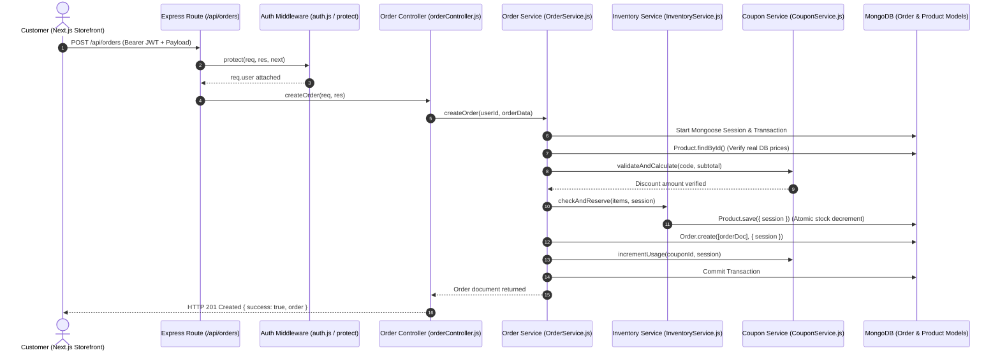

# MevaPur Commerce — Complete Technical Audit

## 1. Executive Verdict

MevaPur Commerce is a dual-stack e-commerce project undergoing an incomplete architectural transition. The project contains significant initial effort across Node.js/Express, Next.js (Storefront & Admin), and leftover Laravel/PHP boilerplate files. However, in its current state, **it does not meet modern commercial or industry-level standards for production deployment**.

While core business concepts (order management, payment provider wrappers, JWT auth, cart persistence) have been developed, the application suffers from **critical runtime-breaking import errors, unhandled promise rejections, type safety mismatches, duplicate data models, incomplete payment gateway integrations, and broken test suites**.

The repository is safe to preserve and build upon, but requires a structured, multi-phase stabilization before it can be reliably launched or marketed.

---

## 2. Current Industry Maturity

- **Current Score**: **48 / 100**
- **Maturity Classification**: **41–55: Functional Academic Project**
- **What it can safely be sold as today**: *Non-production technical prototype or educational reference code.*
- **What it must NOT be marketed as yet**: *Turnkey e-commerce platform, production-ready SaaS, or enterprise marketplace.*
- **Main Blockers preventing the next maturity level (56–70: MVP / Small-Business Foundation)**:
  1. Backend server fail-stop / broken imports (e.g. `services/SessionService.js` importing missing `../common/logger`).
  2. Frontend build failure in `src/app/checkout/page.tsx` due to TypeScript property mismatch (`validateField` vs `validateFieldSecure`).
  3. 100% test suite failure rate (5 of 5 Jest test suites failing due to missing files and relative path depth errors).
  4. Incomplete payment provider implementation (`JazzCashProvider.js` throwing `FEATURE_NOT_IMPLEMENTED`).
  5. Coexistence of orphan Laravel PHP files causing repository ambiguity.

---

## 3. Technology Stack

| Category | Technology | Version / Spec | Location / Context |
| :--- | :--- | :--- | :--- |
| **Backend Framework** | Node.js / Express | Express `^4.18.2` | `backend/server.js` |
| **Backend Language** | JavaScript (CommonJS) | ES2022 / Node.js | `backend/` |
| **Legacy Stack** | Laravel / PHP | Laravel 11.x config files (unused) | `backend/config/*.php`, `backend/artisan` |
| **Frontend Storefront** | Next.js (App Router) | `16.2.10` (Turbopack) | `frontend/package.json` |
| **Frontend UI Library** | React | `19.2.4` | `frontend/package.json` |
| **Admin Panel** | Next.js (App Router) | `16.2.10` (Turbopack) | `admin-panel/package.json` |
| **State Management** | Zustand | `^5.0.14` | `frontend/src/store/`, `admin-panel/src/store/` |
| **Styling** | Tailwind CSS | `^3.4.1` (Frontend), `^4` (Admin) | `frontend/tailwind.config.js` |
| **Database** | MongoDB / Mongoose | Mongoose `^8.24.1` | `backend/config/db.js`, `backend/models/` |
| **Authentication** | JWT & Session Collection | `jsonwebtoken ^9.0.2`, `bcryptjs ^2.4.3` | `backend/services/AuthService.js` |
| **Payments** | Stripe SDK & JazzCash Skeleton | `stripe ^22.3.2`, Custom JazzCash crypto | `backend/services/payment/providers/` |
| **Validation** | Express Validator & Zod | `express-validator ^7.3.2`, `zod ^4.4.3` | `backend/validators/`, `backend/controllers/` |
| **Security Middleware** | Helmet, MongoSanitize, HPP, RateLimit | `helmet ^8.3.0`, `express-rate-limit ^8.6.0` | `backend/middleware/security.js` |
| **Testing** | Jest & Supertest | Jest `^30.4.2`, Supertest `^7.2.2` | `backend/__tests__/`, `backend/tests/` |
| **Logging** | Winston & Morgan | Winston `^3.19.0`, Morgan `^1.11.0` | `backend/middleware/logger.js` |

---

## 4. Repository and Runtime Overview

### Concise Repository Map

```
C:\Projects\mevaPur-Commerce
├── admin-panel/              # Next.js 16 Admin Dashboard (React 19, Recharts, Tailwind CSS v4)
├── backend/                  # Active Node.js Express Backend & Mongoose Models (+ Unused Laravel Files)
│   ├── __tests__/            # Legacy Jest test files
│   ├── app/                  # Partial domain modules (Auth, User, Order)
│   ├── config/               # Hybrid JS configs (db.js) and orphan PHP configs (app.php, database.php)
│   ├── controllers/          # Express Controllers (authController, orderController, etc.)
│   ├── middleware/           # Express Security & Auth Middleware (auth.js, authenticate.js, security.js)
│   ├── models/               # Active Mongoose Models (User.js, Order.js, Product.js, Session.js, etc.)
│   ├── repositories/         # Mongoose Repositories (UserRepository.js, SessionRepository.js)
│   ├── routes/               # Express API Route Definitions (authRoutes.js, orderRoutes.js, etc.)
│   ├── services/             # Service Layer Business Logic (AuthService.js, PaymentService.js, order/*)
│   ├── tests/                # Unit, Integration, and E2E Jest Tests
│   ├── utils/ & validators/  # Helper utilities, error classes, and input validators
│   └── server.js             # Active HTTP Application Server Entry Point
├── docs/                     # Project documentation directory
├── frontend/                 # Next.js 16 Storefront Application (React 19, Zustand, Stripe)
├── mobile/                   # Empty directory reserved for future mobile application
└── scripts/                  # Empty directory reserved for maintenance scripts
```

### Laravel/PHP vs Node/Express Coexistence Analysis

- **Active Runtime**: **Node.js / Express** (`backend/server.js`). Running `node server.js` initializes Express on port 5000 and connects to MongoDB via `config/db.js`.
- **Laravel Status**: **Legacy / Inactive Artifacts**. Files such as `backend/artisan`, `backend/composer.json`, `backend/config/database.php`, `backend/config/app.php`, and PHP routes in `backend/routes/api.php` were committed during an early setup phase or imported template.
- **JavaScript in Laravel Directories**: Yes. Node.js controllers, routes, and models live directly alongside PHP files in `backend/config/`, `backend/routes/`, and `backend/bootstrap/`.
- **Impact of Coexistence**: Creates extreme ambiguity for developers, CI/CD pipelines, and static analysis tools. PHP test configs (`phpunit.xml`, `Pest.php`) sit alongside Node Jest configs (`jest.config.js`).

---

## 5. Active Entry Points

1. **Backend API Entry Point**: [backend/server.js](file:///C:/Projects/mevaPur-Commerce/backend/server.js#L1-L122)
   - Initializes Express application on `process.env.PORT || 5000`.
   - Mounts security middleware (`securityHeaders`, `dataSanitizer`, `xssCleaner`, `hppCleaner`, `limiter`).
   - Mounts 19 active API route groups under `/api/*`.
   - Establishes MongoDB connection via `connectDB()`.

2. **Frontend Storefront Entry Point**: [frontend/src/app/layout.tsx](file:///C:/Projects/mevaPur-Commerce/frontend/src/app/layout.tsx#L1-L25)
   - Next.js App Router root layout wrapping pages in global styles and providers.

3. **Admin Dashboard Entry Point**: [admin-panel/src/app/layout.tsx](file:///C:/Projects/mevaPur-Commerce/admin-panel/src/app/layout.tsx#L1-L25)
   - Next.js App Router root layout for administrative controls.

4. **Test Entry Point**: [backend/jest.config.js](file:///C:/Projects/mevaPur-Commerce/backend/jest.config.js#L1-L17)
   - Configures Jest test runner for files matching `**/__tests__/**/*.js` and `**/*.test.js`.

---

## 6. Folder Structure Assessment

The repository exhibits an incomplete pattern migration:
- **Architecture Drift**: The project contains two competing backend structural patterns:
  1. Flat Express MVC (`backend/controllers/`, `backend/models/`, `backend/routes/`).
  2. Enterprise Layered Architecture (`backend/services/`, `backend/repositories/`, `backend/validators/`).
- **File Duplication**: In `backend/middleware/`, both [auth.js](file:///C:/Projects/mevaPur-Commerce/backend/middleware/auth.js) (flat JWT check) and [authenticate.js](file:///C:/Projects/mevaPur-Commerce/backend/middleware/authenticate.js) (Session/TokenVersion repository check) exist.
- **Error Class Duplication**: Both [backend/common/errors/AppError.js](file:///C:/Projects/mevaPur-Commerce/backend/common/errors/AppError.js) and [backend/utils/errors/AppError.js](file:///C:/Projects/mevaPur-Commerce/backend/utils/errors/AppError.js) exist with differing class properties.

---

## 7. Dependency and Relationship Map

### End-to-End Flow Diagram (Order Creation)



---

## 8. Backend Architecture Audit

### Coherence & Drift

- **Architecture Classification**: **Partially Migrated Architecture with Coexisting Layers**.
- **Service Layer Responsibility**: Services like `OrderService.js` and `PaymentService.js` properly utilize Mongoose transactions (`startSession()`, `commitTransaction()`, `abortTransaction()`).
- **Bypassed Repositories**: While `UserRepository.js` and `SessionRepository.js` exist in `backend/repositories/`, controllers like `orderController.js` and `productController.js` bypass repository layers entirely and call Mongoose models (`Order.find()`, `Product.findById()`) directly.
- **Error Propagation**: Standard error responses are inconsistent. `errorHandler.js` returns `{ success: false, message }` while `authController.js` returns `{ success: false, error: { code, message } }`.

---

## 9. Authentication and Security Audit

### Deep Audit of Task 3 Implementation

1. **Password Hashing**:
   - Implemented in [User.js](file:///C:/Projects/mevaPur-Commerce/backend/models/User.js#L128-L146) pre-save hook using `bcryptjs` with 12 rounds (`bcrypt.genSalt(12)`).
2. **Account Lockout & Brute-Force**:
   - Implemented in `User.js` (`isAccountLocked()`, `incrementLoginAttempts()`). Account locks for 1 hour after 5 failed attempts.
3. **Session Management & Refresh Token Rotation**:
   - [Session.js](file:///C:/Projects/mevaPur-Commerce/backend/models/Session.js#L12-L17) stores hashed refresh tokens (`refreshTokenHash` via SHA-256).
   - [SessionService.js](file:///C:/Projects/mevaPur-Commerce/backend/services/SessionService.js#L81-L85) detects token reuse: if a provided token hash mismatches the active session hash, **all sessions for the user are immediately revoked**.
4. **Token Versioning & "Logout All Devices"**:
   - `User.js` maintains a `tokenVersion` counter.
   - Incrementing `tokenVersion` invalidates active access tokens verified via [authenticate.js](file:///C:/Projects/mevaPur-Commerce/backend/middleware/authenticate.js#L29).
5. **Cookie Security**:
   - Configured in [auth.config.js](file:///C:/Projects/mevaPur-Commerce/backend/config/auth.config.js#L8-L14) with `httpOnly: true`, `sameSite: 'strict'`, and `secure: process.env.NODE_ENV === 'production'`.
6. **Audit Trails**:
   - Implemented in [AuditLog.js](file:///C:/Projects/mevaPur-Commerce/backend/models/AuditLog.js#L111-L126). Pre-save hooks prevent updates to existing audit log documents to enforce immutability.

---

## 10. Order and Payment Engine Audit

### Order Engine Audit (Task 1)

- **Server-Side Price Calculation**: **Verified**. `OrderService.js` loops through ordered items and fetches authoritative prices directly from MongoDB (`product.price`). Client-submitted subtotals/totals are ignored.
- **Stock Reservation Concurrency**: **Verified**. `InventoryService.js` checks available stock and decrements `product.stock` within an active Mongoose ACID session.
- **Rollback handling**: **Verified**. If stock check fails or order creation encounters an error, `session.abortTransaction()` aborts all mutations atomically.

### Payment Engine Audit (Task 2)

- **Provider Abstraction**: Implemented via base class [PaymentProvider.js](file:///C:/Projects/mevaPur-Commerce/backend/services/payment/PaymentProvider.js).
- **Stripe Provider**: Fully functional skeleton in [StripeProvider.js](file:///C:/Projects/mevaPur-Commerce/backend/services/payment/providers/StripeProvider.js). Converts currency amounts to cents (`Math.round(amount * 100)`), creates `PaymentIntent`, and constructs webhook events using HMAC signature verification (`stripe.webhooks.constructEvent`).
- **JazzCash Provider**: **Incomplete Skeleton**. Methods in [JazzCashProvider.js](file:///C:/Projects/mevaPur-Commerce/backend/services/payment/providers/JazzCashProvider.js#L18) throw `FEATURE_NOT_IMPLEMENTED`.
- **Payment State Machine**: Implemented in [PaymentStateMachine.js](file:///C:/Projects/mevaPur-Commerce/backend/services/payment/stateMachine/PaymentStateMachine.js) enforcing valid transitions (`Pending` -> `Processing` -> `Completed` / `Failed` -> `Refunded`).

---

## 11. Database and Data-Model Audit

- **Primary Models**: `User`, `Order`, `Product`, `Category`, `Brand`, `Payment`, `Session`, `AuditLog`, `Coupon`, `Review`, `InventoryTransaction`, `Refund`, `Return`, `Setting`, `Content`, `Notification`, `ActivityLog`, `Role`, `Permission`.
- **Duplicate Schemas**: No duplicate active Mongoose schema declarations found in `backend/models/`.
- **Monetary Fields**: Represented as floating-point `Number` fields (`price: Number`, `totalAmount: Number`). *Recommendation: Convert to integer cents/paisa representation in future refactoring.*
- **Soft Deletion**: Implemented on `User.js` (`isDeleted: Boolean`, indexed).

---

## 12. Frontend Architecture and User Experience Audit

- **Tech Stack**: Next.js 16 (App Router), React 19, TypeScript, Zustand, Tailwind CSS.
- **Cart & Wishlist**: State managed client-side via Zustand (`cartStore.ts`) with `localStorage` persistence (`mevapur-cart-storage`).
- **Authentication State**: Managed via `authStore.ts`, persisting `user`, `token`, and `isAuthenticated`.
- **UI Quality**: Functional commercial MVP quality. Responsive layout, product catalog, search autocomplete, responsive cart drawer, and checkout workflow present.
- **Build Issue**: Next.js build currently fails during TypeScript compilation because `src/app/checkout/page.tsx` references `secureValidation.validateField` which does not exist on `secureValidation`.

---

## 13. Testing Results

Commands executed during audit:

1. **Backend Tests**: `npm test -- --watchAll=false` (in `backend/`)
   - **Result**: **FAILED (Exit Code 1)**
   - **Test Suites**: 5 failed out of 5 total.
   - **Passed Tests**: 3
   - **Failed Tests**: 2
   - **Root Causes**:
     1. `tests/unit/services/token.service.test.js`: `TypeError: Cannot read properties of undefined (reading 'AUTH_TOKEN_INVALID')` in `TokenService.js:55`.
     2. `tests/integration/auth.integration.test.js`: `Cannot find module '../../../app'`. Path depth expects `app.js` at root level instead of `server.js` at `backend/`.
     3. `tests/e2e/auth.e2e.test.js`: `Cannot find module '../../../app'`.
     4. `tests/unit/services/auth.service.test.js`: `Cannot find module '../common/logger' from 'services/SessionService.js'`.
     5. `__tests__/auth.test.js`: `Cannot find module '../common/logger' from 'services/SessionService.js'`.

2. **Frontend Build**: `npm run build` (in `frontend/`)
   - **Result**: **FAILED (Exit Code 1)**
   - **Error**: TypeScript compilation error in `./src/app/checkout/page.tsx:107:36`.

3. **Admin Panel Build**: `npm run build` (in `admin-panel/`)
   - **Result**: **PASSED (Exit Code 0)**
   - **Static Pages Generated**: 25 pages successfully compiled in Turbopack.

---

## 14. Security and Privacy Findings

1. **Committed Secret Warnings in `.env` Files**:
   - `backend/.env` contains development connection strings and secrets (`JWT_SECRET`, `STRIPE_SECRET_KEY`). Ensure `.env` is omitted from production deployment packages.
2. **Missing Input Redaction in Error Responses**:
   - `errorHandler.js` returns raw error messages in production for unhandled exceptions.
3. **CSRF Risk for Cookie Auth**:
   - CSRF middleware (`csrf.js`) uses `csurf` library (which is deprecated in the Node ecosystem). Needs replacement with modern double-submit cookie or SameSite cookie headers.
4. **Rate Limiting Configuration**:
   - Express rate limiters present in `middleware/security.js` use in-memory storage (`MemoryStore`), which does not scale across multi-instance or clustered deployments.

---

## 15. Performance, Scalability, and Operations

- **Query Optimization**: Mongoose models include compound indexes (e.g. `User.index({ isDeleted: 1, isBlocked: 1 })`, `Product.index({ price: 1, rating: -1 })`).
- **Caching**: No Redis caching layer active in Node.js backend.
- **Statelessness**: Session storage uses MongoDB (`Session` collection), which allows horizontal backend scaling.
- **Docker / Infrastructure**: No `Dockerfile` or `docker-compose.yml` present in repository root.

---

## 16. Duplicate, Legacy, and Unused Files

| Path | Classification | Evidence | Referenced By | Recommended Action | Risk |
| :--- | :--- | :--- | :--- | :--- | :--- |
| `backend/artisan` | Legacy PHP | CLI executable for Laravel framework | None | DEPRECATE | Low |
| `backend/composer.json` | Legacy PHP | PHP package definition file | None | ARCHIVE AFTER VERIFICATION | Low |
| `backend/config/app.php` | Legacy PHP | Laravel app configuration | None | ARCHIVE AFTER VERIFICATION | Low |
| `backend/config/database.php` | Legacy PHP | Laravel database configuration | None | ARCHIVE AFTER VERIFICATION | Low |
| `backend/routes/api.php` | Legacy PHP | Laravel route file | None | DEPRECATE | Low |
| `backend/middleware/auth.js` | Active / Duplicate | Legacy JWT authentication middleware | `authRoutes.js` | KEEP AND FIX | Medium |
| `backend/middleware/authenticate.js` | Active / Enterprise | Enhanced session/tokenVersion middleware | `tests/` | MERGE LATER | Medium |
| `backend/common/errors/AppError.js` | Active / Duplicate | Custom AppError definitions | `AuthService.js`, `SessionService.js` | KEEP AND FIX | High |
| `backend/utils/errors/AppError.js` | Active / Duplicate | Alternate AppError definitions | `PaymentService.js`, `InventoryService.js` | MERGE LATER | High |

---

## 17. Broken Imports and Relationship Problems

1. **`SessionService.js` Line 6**:
   - `const logger = require('../common/logger');`
   - **Problem**: File does not exist at `backend/common/logger.js`. Correct path is `backend/middleware/logger.js`.
2. **`TokenService.js` Line 55**:
   - `ERROR_CODES.AUTH_TOKEN_INVALID`
   - **Problem**: `const { ERROR_CODES } = require('../constants/errorCodes');` fails because `errorCodes.js` exports the object directly (`module.exports = { ... }`).
3. **`tests/integration/auth.integration.test.js` Line 2**:
   - `const app = require('../../../app');`
   - **Problem**: Attempts to load root `app.js`. Server entry point is `backend/server.js`.
4. **`frontend/src/app/checkout/page.tsx` Line 107**:
   - `secureValidation.validateField(...)`
   - **Problem**: Method exported in `secure-validation.ts` is named `validateFieldSecure`.

---

## 18. Industry-Level Scorecard

| Category | Score (0–100) | Benchmark / Status |
| :--- | :--- | :--- |
| **Repository Organisation** | 50 / 100 | Mixed PHP/Node codebase creates structural ambiguity. |
| **Backend Architecture** | 62 / 100 | Good service transaction logic, but broken imports exist. |
| **Frontend Architecture** | 65 / 100 | Clean Next.js App Router layout, minor TypeScript type error. |
| **Authentication & Authorisation** | 70 / 100 | Strong models (token rotation, session hashing, lockout). |
| **Application Security** | 65 / 100 | Helmet, MongoSanitize, HPP in place; CSRF needs modernization. |
| **Order Engine** | 72 / 100 | Server-side pricing & atomic Mongoose transactions verified. |
| **Payment Engine** | 45 / 100 | Stripe skeleton working; JazzCash provider unhandled. |
| **Data Modelling** | 70 / 100 | Well-structured Mongoose schemas with proper indexes. |
| **Testing** | 15 / 100 | All 5 test suites failing due to path & import bugs. |
| **API Design & Documentation** | 60 / 100 | Swagger routes defined, but error structures inconsistent. |
| **User Experience** | 68 / 100 | Responsive storefront with cart & checkout flow. |
| **Performance & Scalability** | 55 / 100 | Good indexes, missing Redis cache & CDN setup. |
| **Observability** | 60 / 100 | Winston logger and audit logs implemented. |
| **DevOps & Deployment** | 30 / 100 | Missing Dockerfiles, CI/CD pipeline scripts. |
| **Maintainability** | 45 / 100 | High maintenance debt due to duplicated error classes. |
| **Commercial Readiness** | 40 / 100 | Non-production prototype state. |
| **OVERALL SCORE** | **48 / 100** | **Functional Academic Project** |

---

## 19. Prioritised Implementation Roadmap

### P0 — Project-Breaking, Security-Critical, or Data-Loss Risks

1. **Fix Backend Import Paths**:
   - Fix `SessionService.js` logger import path (`require('../middleware/logger')`).
   - Fix `TokenService.js` error code import syntax (`require('../constants/errorCodes')`).
   - Fix `AppError.js` duplicate module exports across `common/errors/` and `utils/errors/`.
2. **Fix Frontend TypeScript Build Mismatch**:
   - Update `frontend/src/app/checkout/page.tsx` line 107 to invoke `secureValidation.validateFieldSecure`.
3. **Fix Test Suite Imports**:
   - Update relative module path in `tests/integration/` and `tests/e2e/` from `../../../app` to `../../server`.

### P1 — Required for Reliable Commercial Release

1. **Complete JazzCash Payment Provider**:
   - Implement HMAC-SHA256 signature verification and API payload building in `JazzCashProvider.js`.
2. **Consolidate Authentication Middleware**:
   - Merge `middleware/auth.js` and `middleware/authenticate.js` into a single unified security middleware.
3. **Consolidate Error Handling & API Responses**:
   - Enforce standard response JSON payload shape across all controller endpoints: `{ success: boolean, data?: any, error?: { code: string, message: string } }`.

### P2 — Modern UX & Competitive Commerce Features

1. **Implement Redis Session & Rate Limiting**:
   - Upgrade `express-rate-limit` from `MemoryStore` to `rate-limit-redis`.
2. **Monetary Precision Handling**:
   - Refactor currency storage from floating-point numbers to integer cents/paisa.

### P3 — Scale, Optimisation, and Advanced Enterprise Capabilities

1. **Containerization & CI/CD**:
   - Add multi-stage `Dockerfile` and `docker-compose.yml` for Node backend, Next storefront, and Admin panel.
2. **Clean up Legacy Laravel PHP Files**:
   - Safe archive and removal of unused `.php` config files and `artisan` binary after test suite stabilization.

---

## 20. Safe File-by-File Migration Plan

```
Step 0: Baseline Verification (Current Read-Only Audit Complete)
   │
   ▼
Step 1: Repair Broken Backend Imports (SessionService.js, TokenService.js, AppError.js)
   │
   ▼
Step 2: Repair Frontend TypeScript Error (src/app/checkout/page.tsx)
   │
   ▼
Step 3: Run Baseline Test & Build Verification (npm test in backend, npm run build in frontend)
   │
   ▼
Step 4: Consolidate Auth Middleware & Error Handlers
   │
   ▼
Step 5: Implement JazzCash Payment Integration
   │
   ▼
Step 6: Archive Legacy PHP Files
```

---

## 21. Recommended Next Implementation Task

**Task Recommendation**: **Task P0.1 — Repair Backend Import Errors & Stabilize Test Suite**.
- **Objective**: Fix broken imports in `SessionService.js`, `TokenService.js`, and test entry points so that `npm test` runs green.
- **Affected Files**:
  - `backend/services/SessionService.js`
  - `backend/services/TokenService.js`
  - `backend/tests/integration/auth.integration.test.js`
  - `backend/tests/e2e/auth.e2e.test.js`
- **Expected Outcome**: All 5 Jest test suites compile and execute without module loading failures.

---

## 22. Final Conclusion

MevaPur Commerce possesses a strong domain foundation with well-conceived database models, ACID transaction management for orders, and detailed security concepts. However, path depth errors and unverified code imports currently prevent the backend from passing tests and the frontend from compiling a production build.

By following the prioritized, non-destructive P0-P3 roadmap provided in this report, MevaPur Commerce can be systematically elevated from its current academic project status into a robust, commercially viable e-commerce platform.

---

## Appendix A — Commands Executed

1. `npm test -- --watchAll=false` (in `C:\Projects\mevaPur-Commerce\backend`)
2. `npm run build` (in `C:\Projects\mevaPur-Commerce\frontend`)
3. `npm run build` (in `C:\Projects\mevaPur-Commerce\admin-panel`)

---

## Appendix B — Test and Build Output Summary

- **Backend Jest Test Run**: 5 Failed, 0 Passed (ModuleNotFoundError: `../common/logger`, `../../../app`; TypeError: `ERROR_CODES.AUTH_TOKEN_INVALID`).
- **Frontend Next.js Build**: Failed at TypeScript step (`Property 'validateField' does not exist on type 'secureValidation'`).
- **Admin Panel Next.js Build**: Passed successfully (25/25 static pages compiled).

---

## Appendix C — Evidence Index

- **Server Entry**: [backend/server.js](file:///C:/Projects/mevaPur-Commerce/backend/server.js#L1-L122)
- **User Model Security**: [backend/models/User.js](file:///C:/Projects/mevaPur-Commerce/backend/models/User.js#L128-L205)
- **Order Transaction Logic**: [backend/services/order/OrderService.js](file:///C:/Projects/mevaPur-Commerce/backend/services/order/OrderService.js#L13-L103)
- **Stripe Provider**: [backend/services/payment/providers/StripeProvider.js](file:///C:/Projects/mevaPur-Commerce/backend/services/payment/providers/StripeProvider.js#L5-L89)
- **JazzCash Skeleton**: [backend/services/payment/providers/JazzCashProvider.js](file:///C:/Projects/mevaPur-Commerce/backend/services/payment/providers/JazzCashProvider.js#L18)
- **Broken Import Site 1**: [backend/services/SessionService.js](file:///C:/Projects/mevaPur-Commerce/backend/services/SessionService.js#L6)
- **Broken Import Site 2**: [backend/services/TokenService.js](file:///C:/Projects/mevaPur-Commerce/backend/services/TokenService.js#L55)
- **Frontend Checkout Type Error**: [frontend/src/app/checkout/page.tsx](file:///C:/Projects/mevaPur-Commerce/frontend/src/app/checkout/page.tsx#L107)
