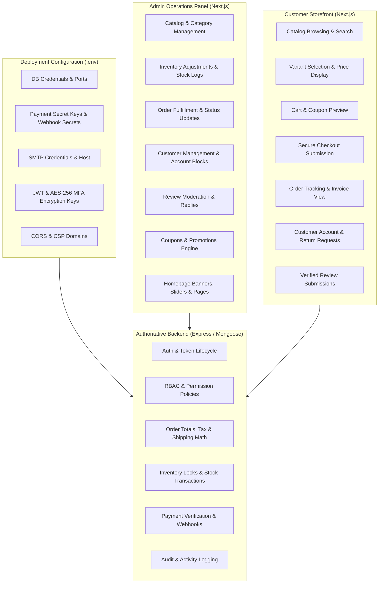

# PRODUCT DIRECTION LOCK — Storefront Architecture & Operating Model

**Repository**: `C:\Projects\mevaPur-Commerce`  
**Target Release Branch**: `release/storefront-client-handover`  
**Base Commit**: `c2d59c32353382a31dfc95f7ecffb838b3fd8c06` (Accepted Admin/Backend Checkpoint)  
**Status**: **LOCKED & ENFORCED**

---

## 1. Product Model & Commercial Scope

The MevaPur platform is architected and built strictly as a **white-label, deploy-per-client, single-merchant Commerce Operating System**.

### 1.1 Non-Negotiable Out-of-Scope Concepts (What V1 Is NOT)
V1 is explicitly NOT:
- A multi-vendor marketplace (e.g., Daraz, Amazon third-party seller model);
- A multi-tenant SaaS application with dynamic tenant subdomain routing or database partitioning;
- A split-payout, escrow, or commission settlement engine;
- An unvetted third-party seller portal with self-registration and seller KYC.

### 1.2 Prohibited Complexities in V1
The codebase must not introduce:
- Seller KYC / document upload workflows;
- Seller-specific store pages, microsites, or catalogs;
- Marketplace commission calculation, retention, or disbursement logic;
- Multi-seller checkout splitting or multi-vendor order routing;
- Seller payout accounts, bank splits, or seller dispute mediation;
- Tenant-level data isolation layers or SaaS subscription billing for sellers;
- Simulated or fake customer urgency (e.g., fake counters, fake viewing numbers, synthetic purchase toasts).

---

## 2. Core V1 Commerce Deliverables

V1 must deliver an enterprise single-merchant commerce experience:

1. **Amazon-Grade Commerce Integrity**:
   - Backend-authoritative price calculation, discount allocation, tax, and shipping rules.
   - Idempotent order placement and payment state transitions.
   - Strict inventory reservation and stock depletion semantics with atomic updates.
2. **Admin-Controlled Ordinary Business Operations**:
   - Direct merchant control over catalog, inventory, pricing, coupons, reviews, orders, customer accounts, and returns.
   - Published vs Draft lifecycle for all customer-visible products and promotions.
3. **Admin-Controlled Storefront Content**:
   - Dynamic management of homepage hero banners, promotional sliders, featured collections, policy pages, FAQs, and contact metadata.
4. **Premium Customer-Facing Storefront UX**:
   - Fast, accessible, responsive shopping experience across mobile (320px–375px), tablet (768px–1024px), and desktop (1280px–1440px+).
   - Frictionless search, faceted filtering, real-time variant selection, wishlist, cart management, and guest/authenticated checkout.
5. **Secure White-Label Deployment per Client**:
   - Environment-driven brand contract (`branding.ts`, `NEXT_PUBLIC_SITE_NAME`, `NEXT_PUBLIC_SITE_URL`, logo, favicon, color tokens).
   - Zero hardcoded runtime brand strings (`HARZAAR`, `MevaPur`) in presentation markup.
6. **Modular Integrations**:
   - Plug-and-play payment providers (Stripe, Cash on Delivery, Bank Transfer, Raast, JazzCash, EasyPaisa).
   - Configurable SMTP transactional email delivery with STARTTLS/TLS and fail-safe rollback.
   - Local/S3 storage providers for product media and document assets.
7. **Trust-First Customer Experience**:
   - Clear order tracking timelines, transparent refund/cancellation status, downloadable PDF/print invoices, and authentic verified-purchase review submissions.

---

## 3. Responsibility & Authority Boundaries

### 3.1 Division of Authority
- **Admin Panel**: Operations-focused interface designed for high-density tabular data, quick actions, inventory adjustments, and content publishing.
- **Storefront**: Customer-, conversion-, and trust-focused shopping interface designed for clarity, visual appeal, speed, and WCAG AA accessibility.
- **Shared Assets**: Both applications consume the same backend API and share brand tokens, but maintain distinct, purpose-built layouts.

---

## 4. Verification & Integrity Rules
- No external AI or third-party service capabilities may be advertised in the UI unless backed by a live, tested, and verifiable backend implementation.
- Every price, discount, tax, and total displayed in checkout must match the server-calculated invoice exactly.
- All Storefront security headers (CSP, HSTS, X-Frame-Options, nosniff) must match the strict production baseline established in Admin.
