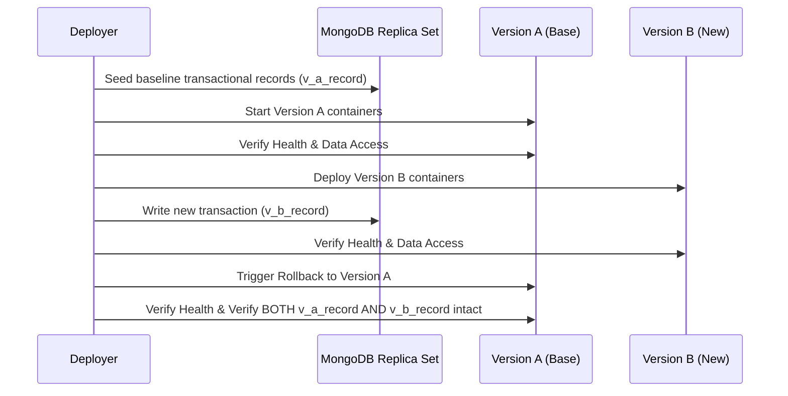

# Operational Runbook: Rollback Procedures (A → B → A Rehearsal)

## 1. Rollback Philosophy & Contract

1. **Version Immutability**: All releases are tagged and built as immutable container image tags (e.g. `mevapur/backend:v1.0.0`, `mevapur/backend:v1.0.1`).
2. **Schema Backward Compatibility**: Database migrations and index additions must follow expand-and-contract patterns so version N-1 code remains functional against version N database.
3. **Data Preservation**: Rollback of code must not drop or corrupt business transactions, customer orders, or payments recorded during the lifetime of version N.

---

## 2. A → B → A Rollback Rehearsal Procedure

The automated rehearsal script `scripts/ops/rehearse-rollback.js` executes the exact lifecycle:



### Executing Rollback Rehearsal
```bash
node scripts/ops/rehearse-rollback.js \
  --versionA=v1.0.0 \
  --versionB=v1.1.0 \
  --mongoUri="mongodb://127.0.0.1:27017/mevapur_rollback_test"
```

---

## 3. Production Emergency Rollback Steps

If an anomaly is detected immediately following a deployment of Version B:

1. **Stop Version B Application Containers**:
   ```bash
   docker compose stop backend frontend admin-panel worker-outbox worker-reconcile-sessions
   ```
2. **Point Compose / Environment to Version A Images**:
   ```bash
   export IMAGE_TAG=v1.0.0  # Previous verified stable version
   ```
3. **Relaunch Version A Services**:
   ```bash
   docker compose up -d --no-deps backend frontend admin-panel worker-outbox worker-reconcile-sessions
   ```
4. **Verify Liveness and Readiness**:
   ```bash
   docker compose ps
   curl -fsS http://localhost/health/ready -H "Host: api.mevapur.com"
   ```
5. **Monitor Logs**:
   ```bash
   docker compose logs -f --tail=50 backend
   ```
